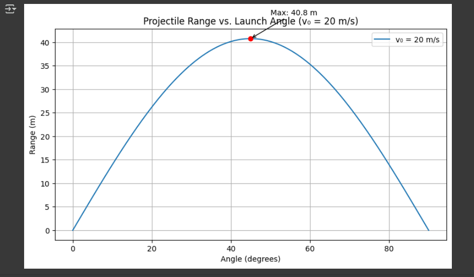
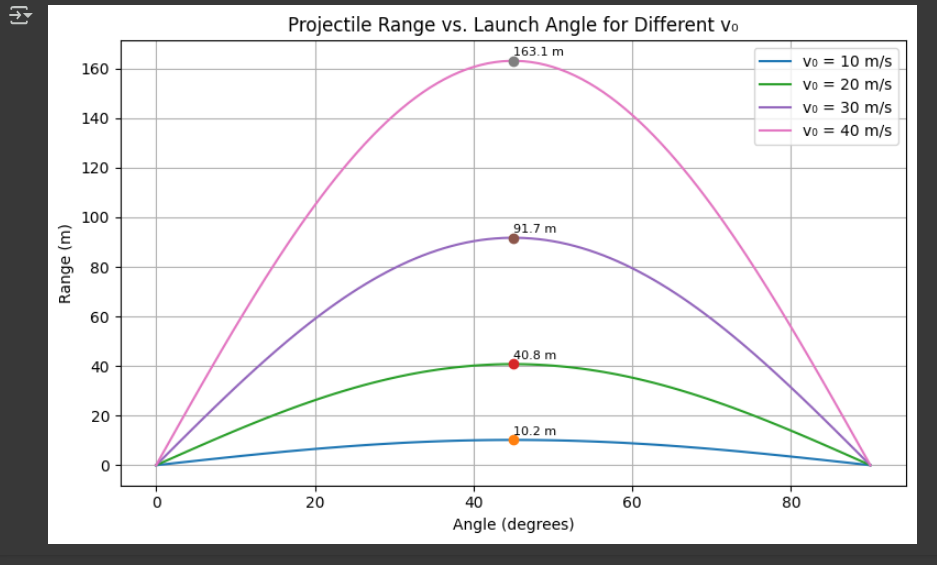
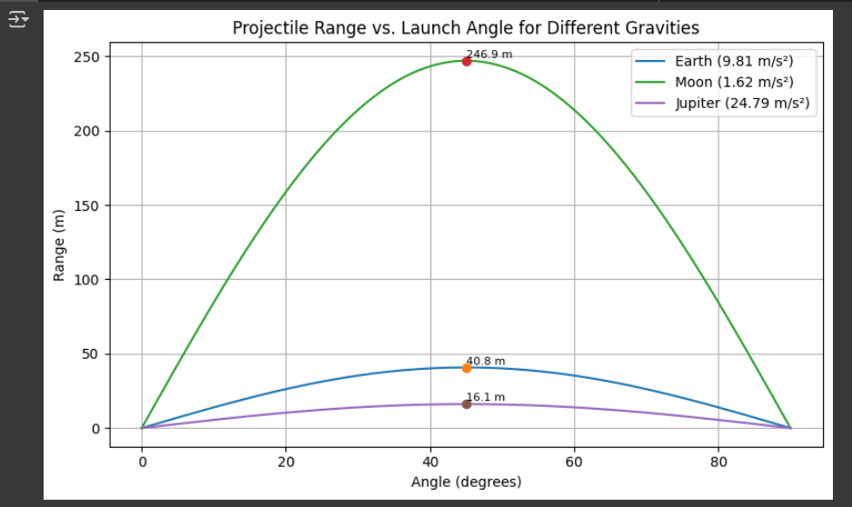
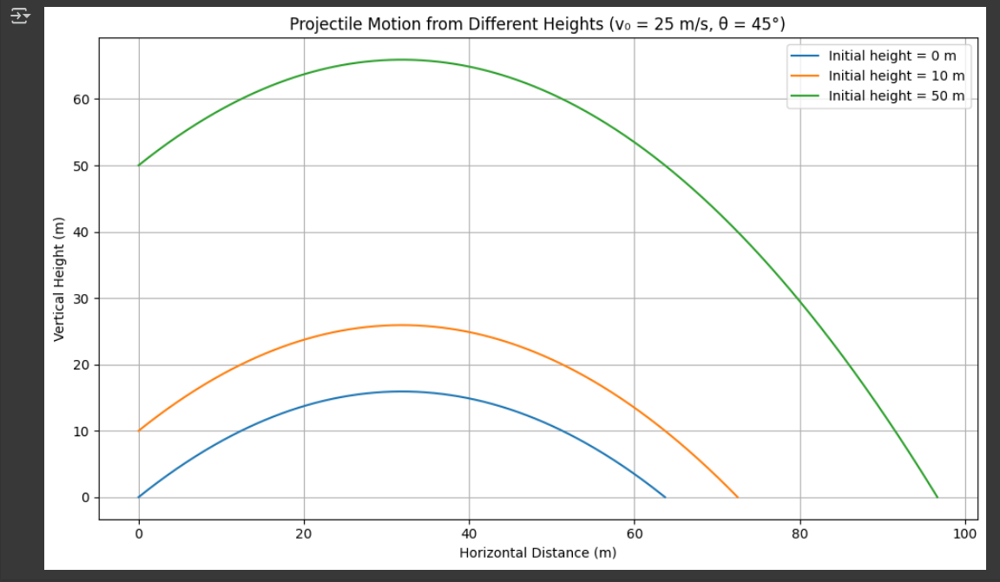
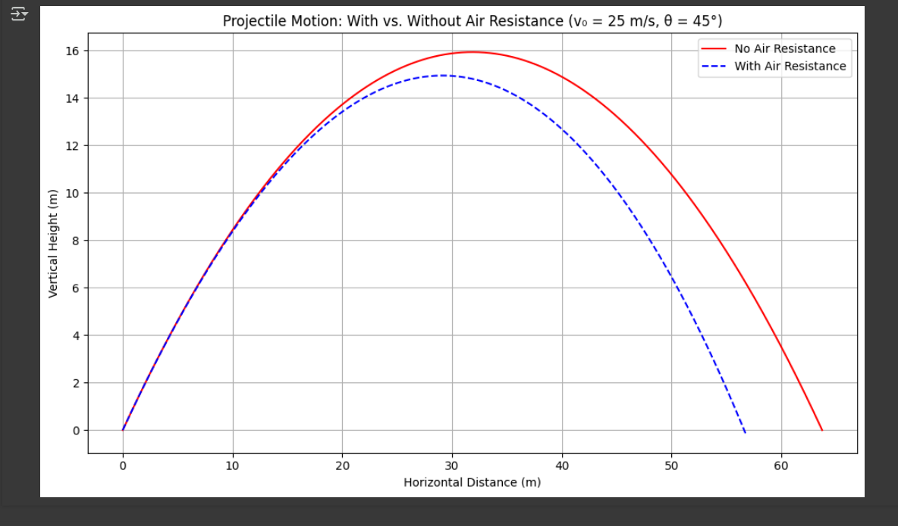
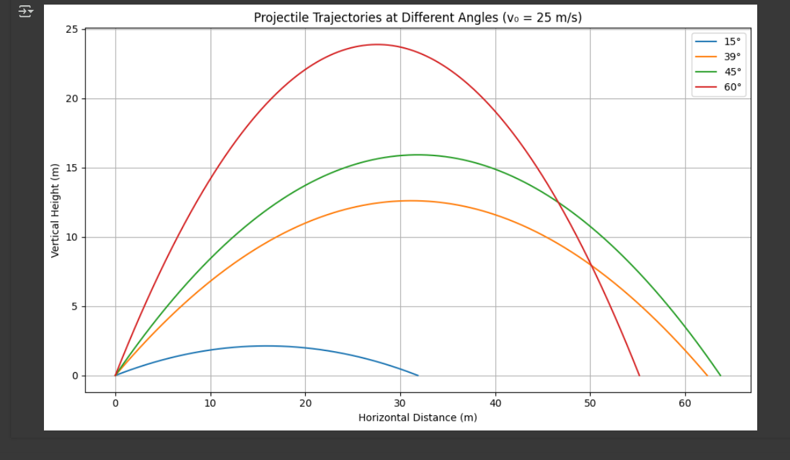

# **Problem 1: Investigating the Range as a Function of the Angle of Projection**

## **1. Theoretical Foundation**

### 1.0 Starting from Newton's Second Law

Projectile motion can be derived from Newton’s Second Law:

\[
\vec{F} = m \vec{a}
\]

In the absence of air resistance, the only force acting on the projectile is gravity, acting in the vertical direction:

\[
\vec{a} = \begin{bmatrix} 0 \\ -g \end{bmatrix}
\]

This leads to the second-order differential equations:

- Horizontal motion:  
$$
\frac{d^2x}{dt^2} = 0
\Rightarrow \frac{dx}{dt} = v_{0x} = v_0 \cos(\theta)
\Rightarrow x(t) = v_0 \cos(\theta) \cdot t
$$


- Vertical motion:  
$$
\frac{d^2y}{dt^2} = -g
\Rightarrow \frac{dy}{dt} = v_0 \sin(\theta) - g t
\Rightarrow y(t) = v_0 \sin(\theta) \cdot t - \frac{1}{2} g t^2
$$

These equations form the theoretical foundation of projectile motion and will be used to derive further quantities such as the time of flight, range, and trajectory.


Projectile motion is a type of two-dimensional motion where an object is launched into the air with an initial velocity $v_0$ at an angle $\theta$ relative to the horizontal. The motion can be analyzed by breaking it into horizontal (x) and vertical (y) components.

### **1.1 Equations of Motion**
The horizontal and vertical components of the initial velocity are:

$$v_{0x} = v_0 \cos(\theta)$$ 

$$v_{0y} = v_0 \sin(\theta)$$

Using the kinematic equations, the motion in each direction is governed by:

- **Horizontal motion (constant velocity, no acceleration in the ideal case):**

$$x = v_{0x} t = v_0 \cos(\theta) t$$

- **Vertical motion (accelerated due to gravity):**

$$y = v_{0y} t - \frac{1}{2} g t^2$$

where:

- $g$ is the acceleration due to gravity $(9.81 \text{ m/s}^2)$
- $t$ is the time of flight.

### **1.2 Time of Flight**

The time of flight is determined by solving for when the projectile returns to the ground 
$(y = 0)$:
$$t = \frac{2 v_0 \sin(\theta)}{g}$$

### **1.3 Range Equation**
The range $$R$$ is the horizontal distance traveled when the projectile lands:
$$R = v_{0x} \cdot t = v_0 \cos(\theta) \cdot \frac{2 v_0 \sin(\theta)}{g}$$

Using the identity $$2 \sin(\theta) \cos(\theta) = \sin(2\theta)$$, we get:
$$R = \frac{v_0^2 \sin(2\theta)}{g}$$

## **2. Analysis of the Range**

- The range is maximized when $$\sin(2\theta) = 1$$, which occurs at $$2\theta = 90^\circ$$, or $$\theta = 45^\circ$$.
- If the initial velocity $$v_0$$ increases, the range increases quadratically.
- If gravity $$g$$ increases (e.g., on another planet), the range decreases.

## **3. Practical Applications**

- **Sports:** Understanding projectile motion is crucial in games like soccer, basketball, and golf.
- **Engineering:** Used in ballistics, rocketry, and artillery targeting systems.
- **Real-World Effects:** Air resistance, wind, and uneven terrain can significantly alter the theoretical range.

## **4. Implementation: Python Simulation**
The following Python script simulates projectile motion and plots the range as a function of the angle of projection.

```python
import numpy as np
import matplotlib.pyplot as plt

def projectile_range(v0=20, g=9.81):
    angles = np.linspace(0, 90, 100)
    angles_rad = np.radians(angles)
    ranges = (v0**2 * np.sin(2 * angles_rad)) / g

    plt.figure(figsize=(8, 5))
    plt.plot(angles, ranges, label=f'v₀ = {v0} m/s')

    max_range = (v0**2 * np.sin(np.radians(90))) / g
    plt.plot(45, max_range, 'ro')  
    plt.annotate(f'Max: {max_range:.1f} m', xy=(45, max_range),
                 xytext=(50, max_range + 5), arrowprops=dict(arrowstyle="->"))

    plt.xlabel("Angle (degrees)")
    plt.ylabel("Range (m)")
    plt.title("Projectile Range vs. Launch Angle (v₀ = 20 m/s)")
    plt.legend()
    plt.grid(True)
    plt.tight_layout()
    plt.show()

projectile_range()
```


*Figure 1: Horizontal range vs. launch angle for a projectile with v₀ = 20 m/s. Maximum range occurs at 45°.*


## **Explanation of the Graph**  

This graph illustrates how the horizontal range of a projectile depends on the launch angle for different initial velocities (\( v_0 \)).  

- Each curve represents a different initial velocity.  
- The maximum range occurs at **45°**.  
- As the initial velocity increases, the range increases **quadratically (\( v_0^2 \))**.  
- Lower initial velocities result in shorter ranges, while higher velocities allow the projectile to travel further.  

This helps in understanding how objects like balls, bullets, or rockets behave when launched at different speeds and angles. 🚀  

```python
import numpy as np
import matplotlib.pyplot as plt

def projectile_range_multi_v0(v0_list, g=9.81):
    angles = np.linspace(0, 90, 100)
    angles_rad = np.radians(angles)

    plt.figure(figsize=(8, 5))
    for v0 in v0_list:
        ranges = (v0**2 * np.sin(2 * angles_rad)) / g
        plt.plot(angles, ranges, label=f'v₀ = {v0} m/s')

        max_range = (v0**2 * np.sin(np.radians(90))) / g
        plt.plot(45, max_range, 'o')  # Nokta koy
        plt.annotate(f'{max_range:.1f} m', xy=(45, max_range),
                     xytext=(45, max_range + 2), fontsize=8)

    plt.xlabel("Angle (degrees)")
    plt.ylabel("Range (m)")
    plt.title("Projectile Range vs. Launch Angle for Different v₀")
    plt.legend()
    plt.grid(True)
    plt.tight_layout()
    plt.show()

projectile_range_multi_v0([10, 20, 30, 40])
```



*Figure 2: Horizontal range vs. launch angle for different initial velocities. Higher v₀ increases the range, and the maximum always occurs at 45°.*

## **Explanation of the Graph**  

This graph shows how the horizontal range of a projectile changes with the launch angle for different gravitational accelerations ($g$).  

- Each curve represents a different gravitational environment: Earth ($g = 9.81 \, \text{m/s}^2$), Moon ($g = 1.62 \, \text{m/s}^2$), and Jupiter ($g = 24.79 \, \text{m/s}^2$).
- As gravity decreases (like on the Moon), the range increases for the same initial velocity.
- On higher gravity bodies (like Jupiter), the range decreases.

This graph helps understand how the same projectile behaves differently in various planetary environments.   


```python
import numpy as np
import matplotlib.pyplot as plt

def projectile_range_multi_g(v0=20, g_values=[9.81, 1.62, 24.79]):
    angles = np.linspace(0, 90, 100)
    angles_rad = np.radians(angles)
    g_labels = ["Earth (9.81 m/s²)", "Moon (1.62 m/s²)", "Jupiter (24.79 m/s²)"]

    plt.figure(figsize=(8, 5))
    for g, label in zip(g_values, g_labels):
        ranges = (v0**2 * np.sin(2 * angles_rad)) / g
        plt.plot(angles, ranges, label=label)

        max_range = (v0**2 * np.sin(np.radians(90))) / g
        plt.plot(45, max_range, 'o')
        plt.annotate(f'{max_range:.1f} m', xy=(45, max_range),
                     xytext=(45, max_range + 2), fontsize=8)

    plt.xlabel("Angle (degrees)")
    plt.ylabel("Range (m)")
    plt.title("Projectile Range vs. Launch Angle for Different Gravities")
    plt.legend()
    plt.grid(True)
    plt.tight_layout()
    plt.show()

projectile_range_multi_g()
```



*Figure 3: Horizontal range vs. launch angle under different gravitational accelerations. Lower gravity leads to longer ranges; maximum always at 45°.*

##  Explanation of the Graph

This graph demonstrates how the **initial height** ($y_0$) affects the projectile's motion.

- Each curve represents a projectile launched from a different height.
- The **higher** the starting point, the **longer** the projectile stays in the air.
- Longer airtime results in a **greater horizontal range**.
- This effect is especially noticeable when launching from elevated positions (e.g., a cliff, a tower).

This concept is useful in real-world scenarios like launching missiles from elevated platforms or analyzing sports trajectories like basketball shots from different angles. 🏀

```python
import numpy as np
import matplotlib.pyplot as plt

def trajectory(v0, angle_deg, y0=0, g=9.81):
    angle_rad = np.radians(angle_deg)
    vy0 = v0 * np.sin(angle_rad)
    t_flight = (vy0 + np.sqrt(vy0**2 + 2 * g * y0)) / g
    t = np.linspace(0, t_flight, 500)
    x = v0 * np.cos(angle_rad) * t
    y = y0 + vy0 * t - 0.5 * g * t**2
    return x, y

v0 = 25
angle = 45
heights = [0, 10, 50]

plt.figure(figsize=(10, 6))
for h in heights:
    x, y = trajectory(v0, angle, y0=h)
    plt.plot(x, y, label=f'Initial height = {h} m')

plt.title("Projectile Motion from Different Heights (v₀ = 25 m/s, θ = 45°)")
plt.xlabel("Horizontal Distance (m)")
plt.ylabel("Vertical Height (m)")
plt.grid(True)
plt.legend()
plt.tight_layout()
plt.show()
```


Figure 4: Trajectories of projectiles launched from different heights (0 m, 10 m, 50 m) at 45° and 25 m/s.

## Explanation of the Graph

This graph compares **projectile motion with and without air resistance**.

- The **red curve** shows the ideal case (no air resistance).
- The **blue dashed curve** includes air resistance.
- With air resistance, the projectile **does not travel as far** and has a **flatter arc**.
- The effect of air resistance becomes more noticeable at higher speeds.

This comparison is essential in real-world applications like ballistics, sports, and aerospace engineering, where air drag cannot be ignored. ✈️

```python
import numpy as np
import matplotlib.pyplot as plt

def trajectory(v0, angle_deg, y0=0, g=9.81):
    angle_rad = np.radians(angle_deg)
    vy0 = v0 * np.sin(angle_rad)
    t_flight = (vy0 + np.sqrt(vy0**2 + 2 * g * y0)) / g
    t = np.linspace(0, t_flight, 500)
    x = v0 * np.cos(angle_rad) * t
    y = y0 + vy0 * t - 0.5 * g * t**2
    return x, y

def trajectory_with_air_resistance(v0, angle_deg, y0=0, g=9.81, k=0.05, dt=0.01):
    angle_rad = np.radians(angle_deg)
    vx = v0 * np.cos(angle_rad)
    vy = v0 * np.sin(angle_rad)
    x, y = 0, y0
    X, Y = [x], [y]

    while y >= 0:
        ax = -k * vx
        ay = -g - k * vy
        vx += ax * dt
        vy += ay * dt
        x += vx * dt
        y += vy * dt
        X.append(x)
        Y.append(y)
    return X, Y

v0 = 25
angle = 45

x1, y1 = trajectory(v0, angle)
x2, y2 = trajectory_with_air_resistance(v0, angle)

plt.figure(figsize=(10, 6))
plt.plot(x1, y1, label='No Air Resistance', color='red')
plt.plot(x2, y2, '--', label='With Air Resistance', color='blue')

plt.title("Projectile Motion: With vs. Without Air Resistance (v₀ = 25 m/s, θ = 45°)")
plt.xlabel("Horizontal Distance (m)")
plt.ylabel("Vertical Height (m)")
plt.legend()
plt.grid(True)
plt.tight_layout()
plt.show()
```



Figure 5: Comparison of trajectories with and without air resistance.


## 🎯 Trajectory Comparison for Different Launch Angles (v₀ = 25 m/s)

This graph shows how the launch angle affects the **trajectory shape** and **horizontal distance** when the **initial velocity is fixed** at 25 m/s.

- All projectiles are launched from the same height and speed.
- Angles used: **15°, 39°, 45°, and 60°**
- The **longest range** is achieved at **45°**.
- Higher angles result in **higher but shorter** trajectories.

```python
import numpy as np
import matplotlib.pyplot as plt

def trajectory(v0, angle_deg, y0=0, g=9.81):
    angle_rad = np.radians(angle_deg)
    vy0 = v0 * np.sin(angle_rad)
    t_flight = (vy0 + np.sqrt(vy0**2 + 2 * g * y0)) / g
    t = np.linspace(0, t_flight, 500)
    x = v0 * np.cos(angle_rad) * t
    y = y0 + vy0 * t - 0.5 * g * t**2
    return x, y

# Parameters
v0 = 25
angles = [15, 39, 45, 60]

plt.figure(figsize=(10, 6))
for angle in angles:
    x, y = trajectory(v0, angle)
    plt.plot(x, y, label=f'{angle}°')

plt.title("Projectile Trajectories at Different Angles (v₀ = 25 m/s)")
plt.xlabel("Horizontal Distance (m)")
plt.ylabel("Vertical Height (m)")
plt.grid(True)
plt.legend()
plt.tight_layout()
plt.show()
```



Figure 6: Trajectories for different launch angles at fixed speed (v₀ = 25 m/s).


## **5. Frequently Asked Questions (FAQ)**  

### **1. At what angle is the maximum range achieved in projectile motion?**  
- The maximum range is achieved at **45°** because, at this angle, the horizontal and vertical components of the velocity are balanced, maximizing distance.

### **2. How does the initial velocity affect the range?**  
- The range increases **quadratically (v₀²)** as the initial velocity increases, meaning a faster launch gives the projectile more distance to travel.

### **3. What happens if gravity changes?**  
- A higher gravitational acceleration **reduces the range** because the projectile falls back to the ground more quickly, while a lower gravity **increases the range** by allowing the projectile to stay in the air longer.

### **4. Does mass affect the projectile's range?**  
- No, in ideal conditions without air resistance, mass does not affect the range because both heavy and light projectiles fall at the same rate under the same conditions.

### **5. How does air resistance impact projectile motion?**  
- Air resistance **reduces the range** by slowing down the projectile and changing its trajectory, making the optimal launch angle lower than 45°.

## ✅ Checklist: Teacher's Suggestions Implemented

| Suggestion                                                                 | Status  | Location in Project |
|----------------------------------------------------------------------------|---------|----------------------|
| 3 different velocities (v₀) at same angle, showing range comparison        | ✔️ Done | *Figure 2* – `projectile_range_multi_v0` |
| 3 different planets (different gravity values) with same initial velocity  | ✔️ Done | *Figure 3* – `projectile_range_multi_g` |
| Launching from different heights                                           | ✔️ Done | *Figure 4* – `heights = [0, 10, 50]` |
| Same speed with different angles (15°, 39°, 45°, 60°)                      | ✔️ Done | *Figure 6* – `angles = [15, 39, 45, 60]` |
| Comparison between with and without air resistance                        | ✔️ Done | *Figure 5* – `trajectory_with_air_resistance()` |

