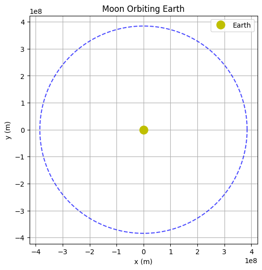
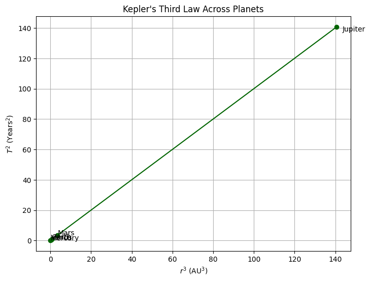
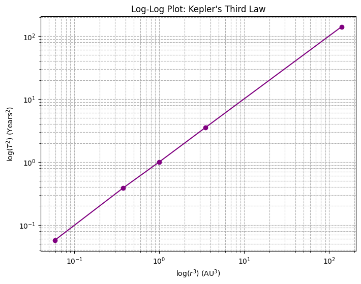
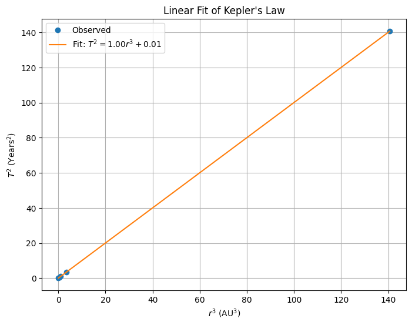

# Orbital Period and Orbital Radius

## Motivation

Kepler's Third Law elegantly describes how the time a celestial object takes to complete its orbit depends on the size of the orbit itself. This deep relationship between period and radius provides powerful tools for calculating planetary distances, masses of stars, and understanding orbital mechanics in systems ranging from satellites to exoplanets.

---

## Derivation of Kepler's Third Law for Circular Orbits

For an object of mass $m$ orbiting a massive body of mass $M$:

The gravitational force provides the necessary centripetal force:

$$
\frac{GMm}{r^2} = m \frac{v^2}{r}
$$

Simplifying for orbital velocity $v$:

$$
v = \sqrt{\frac{GM}{r}}
$$

The orbital period $T$ relates to the circumference of the orbit and velocity:

$$
T = \frac{2\pi r}{v} = 2\pi \sqrt{\frac{r^3}{GM}}
$$

Squaring both sides:

$$
T^2 = \frac{4\pi^2}{GM} r^3
$$

Thus:

$$
T^2 \propto r^3
$$

---

## Applications in Astronomy

- **Measuring Masses**: Orbital data reveal masses of stars, planets, and galaxies.
- **Mapping Distances**: Knowing the period allows inferring distances without direct measurement.
- **Predicting Motion**: Useful for satellite placement and mission planning.

---

## Real-World Examples

### 1. Moon's Orbit Around Earth

```python
import numpy as np
import matplotlib.pyplot as plt

# Constants
g = 6.67430e-11  # m^3 kg^-1 s^-2
M_earth = 5.972e24  # kg
r_moon = 384400e3  # meters

# Orbital period calculation
T_moon = 2 * np.pi * np.sqrt(r_moon**3 / (g * M_earth))
T_moon_days = T_moon / (60 * 60 * 24)
print(f"Calculated Orbital Period of Moon: {T_moon_days:.2f} days")
```
>>Calculated Orbital Period of Moon: 27.45 days


**Note:** This code calculates the Moon's orbital period around Earth using gravitational principles.

---

### Visualizing Moon's Orbit

```python
# Simulate the orbit
n_frames = 250
theta = np.linspace(0, 2*np.pi, n_frames)
x_moon = r_moon * np.cos(theta)
y_moon = r_moon * np.sin(theta)

fig, ax = plt.subplots(figsize=(6,6))
ax.plot(0, 0, 'yo', label='Earth', markersize=12)
ax.plot(x_moon, y_moon, 'b--', alpha=0.7)
ax.set_aspect('equal')
ax.set_xlabel('x (m)')
ax.set_ylabel('y (m)')
ax.set_title('Moon Orbiting Earth')
plt.legend()
plt.grid()
plt.show()
```


**Note:** This simulation shows the Moon's near-circular orbit around Earth.

---

### 2. Planets in the Solar System

```python
# Planets data
radii_AU = np.array([0.39, 0.72, 1.00, 1.52, 5.20])  # AU
periods_years = np.array([0.24, 0.62, 1.00, 1.88, 11.86])
planets = ['Mercury', 'Venus', 'Earth', 'Mars', 'Jupiter']

r_cubed = radii_AU**3
T_squared = periods_years**2

# Plot
plt.figure(figsize=(8,6))
plt.plot(r_cubed, T_squared, 'o-', color='darkgreen')

for i, planet in enumerate(planets):
    plt.annotate(planet,
                 (r_cubed[i], T_squared[i]),
                 textcoords="offset points",
                 xytext=(10,5),  # X ve Y yönünde hafif kaydır
                 ha='left')

plt.xlabel('$r^3$ (AU$^3$)')
plt.ylabel('$T^2$ (Years$^2$)')
plt.title("Kepler's Third Law Across Planets")
plt.grid()
plt.show()

```


**Note:** This plot confirms the $T^2 \propto r^3$ relationship for planets in the Solar System.

---

### 3. ISS Orbit Around Earth

```python
# Constants for ISS
r_iss = 6771e3  # Radius from Earth's center to ISS (Earth's radius + 400 km altitude)

# Orbital period calculation for ISS
T_iss = 2 * np.pi * np.sqrt(r_iss**3 / (g * M_earth))
T_iss_minutes = T_iss / 60
print(f"Orbital Period of ISS: {T_iss_minutes:.2f} minutes")
```
>>Orbital Period of ISS: 92.42 minutes


**Note:** This example shows that the ISS completes an orbit in about 90 minutes, much faster than the Moon.

---

### Log-Log Plot of $T^2$ vs $r^3$

```python
# Log-log plot
plt.figure(figsize=(8,6))
plt.loglog(r_cubed, T_squared, 'o-', color='purple')
plt.xlabel('log($r^3$) (AU$^3$)')
plt.ylabel('log($T^2$) (Years$^2$)')
plt.title('Log-Log Plot: Kepler\'s Third Law')
plt.grid(True, which='both', ls='--')
plt.show()
```


**Note:** A straight line in the log-log plot verifies the power-law relationship.

---

## Extension to Elliptical Orbits

Kepler generalized his Third Law for ellipses by replacing $r$ with the semi-major axis $a$:

$$
T^2 = \frac{4\pi^2}{GM} a^3
$$

Thus, whether an orbit is circular or elliptical, the relation remains consistent.

---

## Simulation: Fitting $T^2$ vs $r^3$

```python
# Fit and plot linear regression
from scipy.stats import linregress

slope, intercept, r_value, _, _ = linregress(r_cubed, T_squared)
fit_line = slope * r_cubed + intercept

plt.figure(figsize=(8,6))
plt.plot(r_cubed, T_squared, 'o', label='Observed')
plt.plot(r_cubed, fit_line, '-', label=f"Fit: $T^2 = {slope:.2f}r^3 + {intercept:.2f}$")
plt.xlabel('$r^3$ (AU$^3$)')
plt.ylabel('$T^2$ (Years$^2$)')
plt.title("Linear Fit of Kepler's Law")
plt.legend()
plt.grid()
plt.show()
```


**Note:** The best-fit line shows how closely the data follows Kepler's Third Law.

---

# Conclusion

Kepler's Third Law, emerging from simple physical principles, connects space and time in the cosmos. From moons to exoplanets, understanding $T^2 \propto r^3$ remains a foundational tool in modern astronomy and physics.

---

# Frequently Asked Questions (FAQ)

### Q1: Why does $T^2$ scale with $r^3$?
Because gravitational force decreases with distance squared, and orbital speed depends on this force. When combined with the relationship between velocity and period, it leads to $T^2 \propto r^3$.

### Q2: Does Kepler's Third Law apply to non-circular orbits?
Yes, it applies to elliptical orbits if we replace $r$ with the semi-major axis $a$.

### Q3: Why do satellites like ISS orbit faster than the Moon?
The closer an object is to Earth, the stronger the gravitational force, leading to a higher orbital velocity and shorter period.

### Q4: What happens if another force acts during orbit?
Additional forces (like atmospheric drag) can cause deviations from pure Keplerian motion, requiring corrections.

### Q5: How is Kepler's Law used today?
It is critical for satellite deployment, interplanetary travel planning, and discovery of exoplanets by observing transit periods and orbital dynamics.
