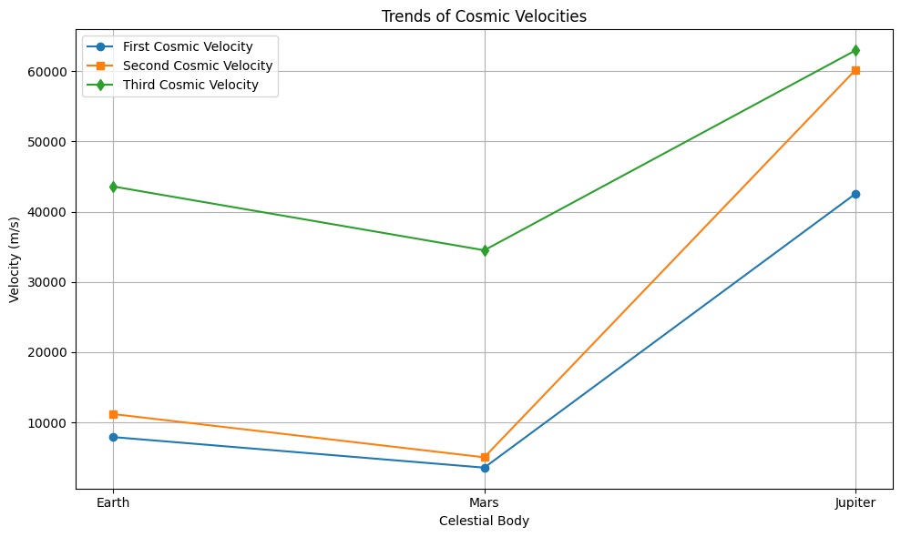
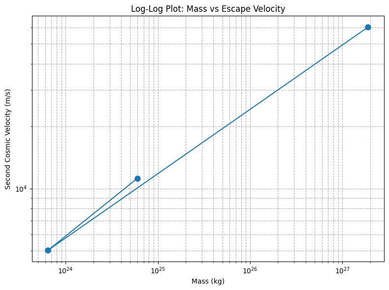
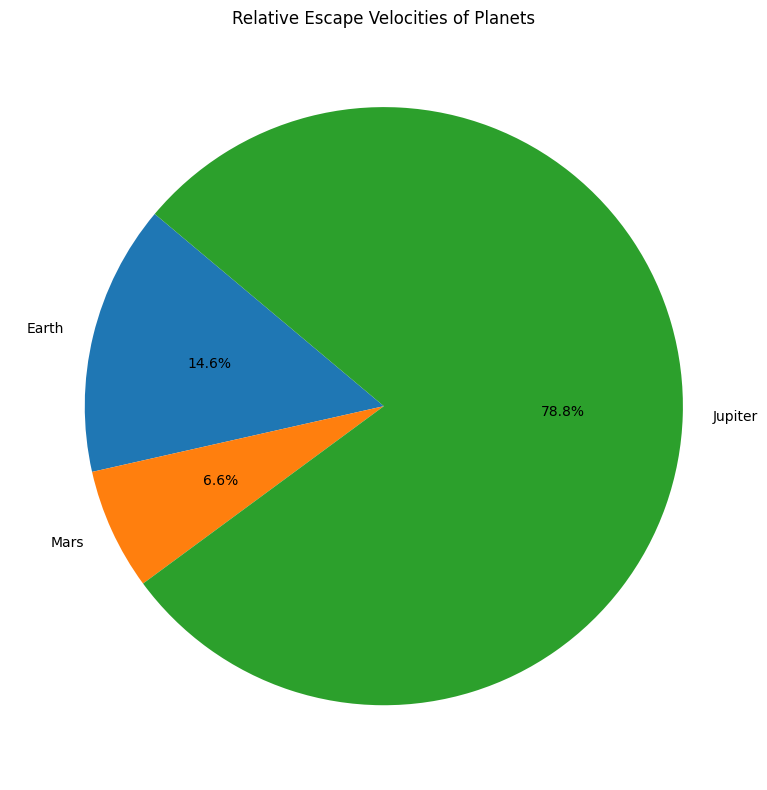

# Escape Velocities and Cosmic Velocities

## Motivation

The concept of **escape velocity** is fundamental to understanding how an object can overcome the gravitational pull of a celestial body. Extending this idea, the definitions of the **first**, **second**, and **third cosmic velocities** describe thresholds for orbiting a planet, escaping a planet's gravity, and leaving a star system entirely.

These principles are crucial for designing satellite launches, planning interplanetary missions, and imagining future interstellar travel.

---

## Definitions of Cosmic Velocities

- **First Cosmic Velocity ($v_1$):** The minimum velocity needed for a stable circular orbit around a planet without propulsion.
- **Second Cosmic Velocity ($v_2$):** The escape velocity — the minimum velocity needed to break free from a celestial body's gravitational field.
- **Third Cosmic Velocity ($v_3$):** The minimum velocity needed to escape the gravitational influence of the star (e.g., the Sun) after escaping the planet.

---

## Mathematical Derivations

### 1. First Cosmic Velocity ($v_1$)

Derived by equating the gravitational force to the centripetal force needed for circular motion:

$$
\frac{GMm}{r^2} = m \frac{v_1^2}{r}
$$

Simplifying:

$$
v_1 = \sqrt{\frac{GM}{r}}
$$

---

### 2. Second Cosmic Velocity ($v_2$)

Derived from energy conservation: kinetic energy must match gravitational potential energy.

$$
\frac{1}{2}mv_2^2 = \frac{GMm}{r}
$$

Thus:

$$
v_2 = \sqrt{2} v_1
$$

or

$$
v_2 = \sqrt{\frac{2GM}{r}}
$$

---

### 3. Third Cosmic Velocity ($v_3$)

Requires overcoming the planet's gravity and then escaping the Sun's gravity from Earth's orbit.

For approximate calculation:

$$
v_3 \approx \sqrt{v_2^2 + v_{esc, Sun}^2}
$$

where $v_{esc, Sun}$ is the Sun's escape velocity at the planet's orbital distance.

---

## Python Simulation and Visualization

We will compute $v_1$, $v_2$, and $v_3$ for **Earth**, **Mars**, and **Jupiter**.

```python
import numpy as np
import matplotlib.pyplot as plt
import pandas as pd

# Constants
G = 6.67430e-11  # Gravitational constant, m^3 kg^-1 s^-2
M_sun = 1.989e30  # Mass of the Sun, kg

# Celestial bodies data
bodies = {
    'Earth': {'mass': 5.972e24, 'radius': 6371e3, 'orbital_radius': 1.496e11},
    'Mars': {'mass': 6.417e23, 'radius': 3389.5e3, 'orbital_radius': 2.279e11},
    'Jupiter': {'mass': 1.898e27, 'radius': 69911e3, 'orbital_radius': 7.785e11}
}

# Function to calculate velocities
def calculate_cosmic_velocities(mass, radius, orbital_radius):
    v1 = np.sqrt(G * mass / radius)
    v2 = np.sqrt(2) * v1
    v_esc_sun = np.sqrt(2 * G * M_sun / orbital_radius)
    v3 = np.sqrt(v2**2 + v_esc_sun**2)
    return v1, v2, v3

# Store results
results = {}

for body, data in bodies.items():
    v1, v2, v3 = calculate_cosmic_velocities(data['mass'], data['radius'], data['orbital_radius'])
    results[body] = {'mass': data['mass'], 'v1': v1, 'v2': v2, 'v3': v3}

# Display results
for body, velocities in results.items():
    print(f"{body}: v1 = {velocities['v1']:.2f} m/s, v2 = {velocities['v2']:.2f} m/s, v3 = {velocities['v3']:.2f} m/s")
```
>> Earth: v1 = 7909.68 m/s, v2 = 11185.98 m/s, v3 = 43587.65 m/s
>> Mars: v1 = 3554.68 m/s, v2 = 5027.08 m/s, v3 = 34500.32 m/s
>> Jupiter: v1 = 42567.51 m/s, v2 = 60199.54 m/s, v3 = 62968.49 m/s

**Note:** This script calculates the first, second, and third cosmic velocities for Earth, Mars, and Jupiter.

---

## Graphical Representations

### 1. Bar Chart of Cosmic Velocities

```python
labels = list(results.keys())
v1_vals = [results[body]['v1'] for body in labels]
v2_vals = [results[body]['v2'] for body in labels]
v3_vals = [results[body]['v3'] for body in labels]

x = np.arange(len(labels))
width = 0.25

fig, ax = plt.subplots(figsize=(10,6))
ax.bar(x - width, v1_vals, width, label='First Cosmic Velocity')
ax.bar(x, v2_vals, width, label='Second Cosmic Velocity')
ax.bar(x + width, v3_vals, width, label='Third Cosmic Velocity')

ax.set_xlabel('Celestial Body')
ax.set_ylabel('Velocity (m/s)')
ax.set_title('Comparison of Cosmic Velocities')
ax.set_xticks(x)
ax.set_xticklabels(labels)
ax.legend()
ax.grid(True)
plt.tight_layout()
plt.show()
```


### 2. Line Plot of Cosmic Velocities

```python
plt.figure(figsize=(10,6))
plt.plot(labels, v1_vals, 'o-', label='First Cosmic Velocity')
plt.plot(labels, v2_vals, 's-', label='Second Cosmic Velocity')
plt.plot(labels, v3_vals, 'd-', label='Third Cosmic Velocity')

plt.xlabel('Celestial Body')
plt.ylabel('Velocity (m/s)')
plt.title('Trends of Cosmic Velocities')
plt.legend()
plt.grid(True)
plt.tight_layout()
plt.show()
```



### 3. Tabular Summary of Velocities

```python
df = pd.DataFrame(results).T[['v1', 'v2', 'v3']]
print(df)
```

>>                    v1            v2            v3
>> Earth     7909.680822  11185.977892  43587.649017
>> Mars      3554.684515   5027.083051  34500.322314
>> Jupiter  42567.506276  60199.544692  62968.486858

### 4. Log-Log Plot (Mass vs Escape Velocity)

```python
mass_vals = [results[body]['mass'] for body in labels]
v2_vals = [results[body]['v2'] for body in labels]

plt.figure(figsize=(8,6))
plt.loglog(mass_vals, v2_vals, 'o-', markersize=8)
plt.xlabel('Mass (kg)')
plt.ylabel('Second Cosmic Velocity (m/s)')
plt.title('Log-Log Plot: Mass vs Escape Velocity')
plt.grid(True, which='both', ls='--')
plt.tight_layout()
plt.show()
```



### 5. Pie Chart (Relative Escape Velocities)

```python
plt.figure(figsize=(8,8))
plt.pie(v2_vals, labels=labels, autopct='%1.1f%%', startangle=140)
plt.title('Relative Escape Velocities of Planets')
plt.tight_layout()
plt.show()
```



---

## Importance in Space Exploration

- **First Cosmic Velocity:** Required to place satellites into stable orbit.
- **Second Cosmic Velocity:** Needed for missions leaving a planet, such as Moon and Mars exploration.
- **Third Cosmic Velocity:** Necessary for deep-space missions and interstellar exploration planning.

Understanding these velocities informs spacecraft design, mission trajectories, and fuel requirements.

---

# Conclusion

Escape velocities and cosmic velocities set the fundamental energy thresholds that govern space exploration. Mastery of these concepts has enabled humanity to place satellites in orbit, reach other planets, and imagine future journeys beyond the Solar System.

---

# Frequently Asked Questions (FAQ)

### Q1: Why is the second cosmic velocity higher than the first?
Because escaping a planet's gravity requires more energy than simply maintaining a stable orbit.

### Q2: Why does Jupiter have a much higher escape velocity than Earth?
Due to its significantly greater mass and size, creating a stronger gravitational field.

### Q3: What challenges exist in achieving the third cosmic velocity?
The enormous amount of energy and precise navigation needed to escape a star's gravity well.

### Q4: How are these velocities achieved in practice?
Using multi-stage rockets, gravitational assists, and carefully planned launch trajectories.

### Q5: Are cosmic velocities affected by atmospheres?
Yes, atmospheric drag must be overcome, requiring additional velocity beyond the theoretical minimums when launching from planets with atmospheres like Earth.