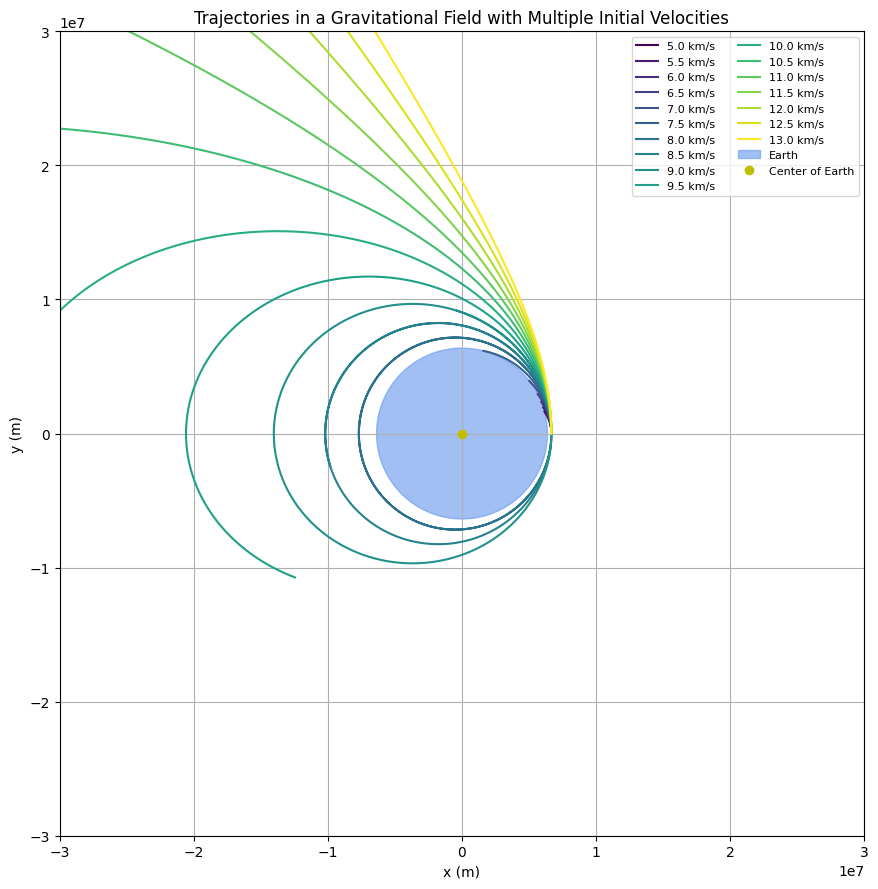
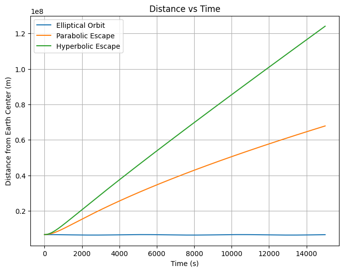

# Problem 3


# Trajectories of a Freely Released Payload Near Earth

## Motivation

When an object is released from a moving rocket near Earth, its trajectory depends on initial conditions such as velocity, angle, and altitude. This problem blends principles of orbital mechanics, energy conservation, and numerical simulation. Understanding these trajectories is critical for missions like satellite deployment, reentry modules, or escaping Earth's gravity.

---

## Types of Possible Trajectories

Depending on the initial velocity ($v_0$) and altitude ($h$), a payload can follow different paths:

- **Elliptical Orbit**: $v_0$ < escape velocity; payload remains bound to Earth.
- **Parabolic Trajectory**: $v_0$ ≈ escape velocity; payload barely escapes Earth's gravity.
- **Hyperbolic Trajectory**: $v_0$ > escape velocity; payload escapes with excess kinetic energy.
- **Suborbital Trajectory**: $v_0$ too low for orbit; payload falls back to Earth.

---

## Fundamental Equations

- Gravitational Force:
  $F = \frac{GMm}{r^2}$

- Gravitational Potential Energy:
  $U = -\frac{GMm}{r}$

- Kinetic Energy:
  $K = \frac{1}{2}mv^2$

- Total Energy (E):
  $E = K + U$

  - If $E < 0$: Elliptical orbit
  - If $E = 0$: Parabolic trajectory
  - If $E > 0$: Hyperbolic escape

---

# Constants and Initial Setup

```python
import numpy as np
import matplotlib.pyplot as plt

G = 6.67430e-11  # Gravitational constant (m^3 kg^-1 s^-2)
M_earth = 5.972e24  # Mass of Earth (kg)
R_earth = 6371e3  # Radius of Earth (m)
altitude = 300e3  # Payload release altitude (m)
r0 = R_earth + altitude
v_escape = np.sqrt(2 * G * M_earth / r0)

print(f"Escape velocity at {altitude/1000:.0f} km altitude: {v_escape/1000:.2f} km/s")
```

>> Escape velocity at 300 km altitude: 10.93 km/s


**Note:** The escape velocity at the release altitude is printed for reference.

---

# Trajectories of Payloads

## Extended Simulation: Payload Trajectories with Multiple Initial Velocities

To better understand how different initial velocities influence a payload's trajectory, we simulate a wide range of speeds from **5.0 km/s to 13.0 km/s**, in **0.5 km/s steps**. This extended analysis helps illustrate the transition from suborbital to hyperbolic escape paths more clearly.

### Simulation Setup

We reuse the principles of Newtonian gravity and apply Euler integration for simplicity. The gravitational field is modeled as originating from a point-mass Earth, and the payload is released from a 300 km altitude above Earth's surface.

The escape velocity from this altitude is approximately:

$$
v_{\text{escape}} = \sqrt{\frac{2GM}{r}} \approx 10.93 \ \text{km/s}
$$

Below, we simulate and plot trajectories for initial velocities ranging from **5.0 km/s** to **13.0 km/s**.

```python
import numpy as np
import matplotlib.pyplot as plt

# Constants
G = 6.67430e-11  # m^3 kg^-1 s^-2
M_earth = 5.972e24  # kg
R_earth = 6371e3  # m
altitude = 300e3  # m
r0 = R_earth + altitude
dt = 1  # time step (s)
steps = 12000

# Velocity range from 5.0 km/s to 13.0 km/s
v_kms = np.arange(5.0, 13.5, 0.5)  # km/s
colors = plt.cm.viridis(np.linspace(0, 1, len(v_kms)))

fig, ax = plt.subplots(figsize=(9, 9))

for i, (v_km, color) in enumerate(zip(v_kms, colors)):
    v0 = v_km * 1000  # convert to m/s
    pos = np.array([r0, 0])
    vel = np.array([0, v0])
    x_vals, y_vals = [], []

    for _ in range(steps):
        r = np.linalg.norm(pos)
        if r < R_earth:
            break
        acc = -G * M_earth * pos / r**3
        vel += acc * dt
        pos += vel * dt
        x_vals.append(pos[0])
        y_vals.append(pos[1])

    ax.plot(x_vals, y_vals, label=f"{v_km:.1f} km/s", color=color)

# Draw Earth
theta = np.linspace(0, 2*np.pi, 300)
ax.fill(R_earth*np.cos(theta), R_earth*np.sin(theta), color='cornflowerblue', alpha=0.6, label="Earth")
ax.plot(0, 0, 'yo', label="Center of Earth")

ax.set_aspect('equal')
ax.set_xlim(-3e7, 3e7)
ax.set_ylim(-3e7, 3e7)
ax.set_xlabel("x (m)")
ax.set_ylabel("y (m)")
ax.set_title("Trajectories in a Gravitational Field with Multiple Initial Velocities")
ax.legend(loc='upper right', fontsize=8, ncol=2)
ax.grid(True)
plt.tight_layout()
plt.show()
```



---

### Visual Output

Each colored curve in the graph represents the path of a payload launched with a different initial velocity. The Earth is shown as a filled blue circle. Trajectories change dramatically based on speed:

- **Low speeds (5–7 km/s)**: payload falls back — suborbital.
- **Around 7.8 km/s**: stable elliptical orbit.
- **At ~11.2 km/s**: payload barely escapes — parabolic.
- **Above 11.5 km/s**: payload escapes Earth's gravity — hyperbolic.

---

### Summary Table: Initial Velocity vs Trajectory Type

| Initial Velocity (km/s) | Behavior                     | Trajectory Type     |
|-------------------------|------------------------------|---------------------|
| 5.0 – 7.0               | Falls back to Earth          | Suborbital          |
| ~7.8                    | Stable orbit                 | Elliptical          |
| ~11.2                   | Just escapes Earth's gravity | Parabolic           |
| 11.5 – 13.0             | Escapes with extra energy    | Hyperbolic          |

---

### Conclusion

This simulation highlights the **sensitive dependence of trajectory on initial velocity**. Even a small increase in speed can shift the outcome from a crash to an escape trajectory.

These insights are crucial in:
- Planning satellite launches,
- Designing escape/reentry paths,
- Interplanetary mission navigation.

By visualizing these effects, we better understand real-world spacecraft behavior in Earth’s gravitational field.


```python
initial_velocities = [0.7 * v_escape, v_escape, 1.2 * v_escape]
labels = ['Elliptical Orbit', 'Parabolic Escape', 'Hyperbolic Escape']
dt = 1  # Time step (s)
steps = 15000

fig, ax_traj = plt.subplots(figsize=(8,8))

for v0, label in zip(initial_velocities, labels):
    pos = np.array([r0, 0])
    vel = np.array([0, v0])
    x_vals, y_vals = [], []

    for _ in range(steps):
        r = np.linalg.norm(pos)
        acc = -G * M_earth * pos / r**3
        vel += acc * dt
        pos += vel * dt
        x_vals.append(pos[0])
        y_vals.append(pos[1])
        if r < R_earth:
            break

    ax_traj.plot(x_vals, y_vals, label=label)

# Draw Earth
theta = np.linspace(0, 2*np.pi, 100)
ax_traj.plot(R_earth*np.cos(theta), R_earth*np.sin(theta), 'k')
ax_traj.set_aspect('equal')
ax_traj.set_xlim(-2e7, 2e7)
ax_traj.set_ylim(-2e7, 2e7)
ax_traj.set_xlabel('x (m)')
ax_traj.set_ylabel('y (m)')
ax_traj.set_title('Payload Trajectories')
ax_traj.legend()
ax_traj.grid()
plt.show()
```


**Note:** This plot shows how different initial speeds result in different types of trajectories.

---

# Energy vs Time

```python
fig, ax_energy = plt.subplots(figsize=(8,6))

for v0, label in zip(initial_velocities, labels):
    pos = np.array([r0, 0])
    vel = np.array([0, v0])
    E_vals, t_vals = [], []

    for t in range(steps):
        r = np.linalg.norm(pos)
        acc = -G * M_earth * pos / r**3
        vel += acc * dt
        pos += vel * dt
        energy = 0.5 * np.linalg.norm(vel)**2 - G * M_earth / r
        E_vals.append(energy)
        t_vals.append(t * dt)
        if r < R_earth:
            break

    ax_energy.plot(t_vals, E_vals, label=label)

ax_energy.set_xlabel('Time (s)')
ax_energy.set_ylabel('Specific Energy (J/kg)')
ax_energy.set_title('Energy vs Time')
ax_energy.legend()
ax_energy.grid()
plt.show()
```


**Note:** This plot shows how the total specific energy evolves over time for different cases.

---

# Velocity vs Time

```python
fig, ax_velocity = plt.subplots(figsize=(8,6))

for v0, label in zip(initial_velocities, labels):
    pos = np.array([r0, 0])
    vel = np.array([0, v0])
    v_vals, t_vals = [], []

    for t in range(steps):
        r = np.linalg.norm(pos)
        acc = -G * M_earth * pos / r**3
        vel += acc * dt
        pos += vel * dt
        v_vals.append(np.linalg.norm(vel))
        t_vals.append(t * dt)
        if r < R_earth:
            break

    ax_velocity.plot(t_vals, v_vals, label=label)

ax_velocity.set_xlabel('Time (s)')
ax_velocity.set_ylabel('Velocity (m/s)')
ax_velocity.set_title('Velocity vs Time')
ax_velocity.legend()
ax_velocity.grid()
plt.show()
```


**Note:** This plot shows how the payload speed changes with time depending on initial conditions.

---

# Distance from Earth vs Time

```python
fig, ax_distance = plt.subplots(figsize=(8,6))

for v0, label in zip(initial_velocities, labels):
    pos = np.array([r0, 0])
    vel = np.array([0, v0])
    r_vals, t_vals = [], []

    for t in range(steps):
        r = np.linalg.norm(pos)
        acc = -G * M_earth * pos / r**3
        vel += acc * dt
        pos += vel * dt
        r_vals.append(r)
        t_vals.append(t * dt)
        if r < R_earth:
            break

    ax_distance.plot(t_vals, r_vals, label=label)

ax_distance.set_xlabel('Time (s)')
ax_distance.set_ylabel('Distance from Earth Center (m)')
ax_distance.set_title('Distance vs Time')
ax_distance.legend()
ax_distance.grid()
plt.show()
```



**Note:** This plot shows the distance of the payload from the Earth's center as a function of time.

---

# Conclusion

Simulating and understanding trajectories for varying initial speeds and angles is essential for modern space missions. From orbital insertions to deep-space escapes, mastering these mechanics is a fundamental part of aerospace engineering.

---

# Frequently Asked Questions (FAQ)

### Q1: Why simulate different angles?
Different angles allow payloads to achieve stable orbit, escape, or crash depending on mission needs.

### Q2: How does energy help classify trajectory type?
Total energy being negative, zero, or positive immediately tells whether the motion is elliptical, parabolic, or hyperbolic.

### Q3: Can air resistance be included?
Yes, adding atmospheric drag would make the simulation more realistic but more complex.

### Q4: Why does velocity decrease after release?
Gravitational pull reduces upward velocity; depending on initial speed, the payload may orbit, escape, or fall.

### Q5: How accurate is Euler's method here?
For small enough time steps ($\Delta t$), it gives reasonably accurate approximations, but better methods exist (e.g., Runge-Kutta 4th order).

[Visit Colab](https://colab.research.google.com/drive/1oLzUpJPz-obhlc4PYpVbjjlrkEAg6NSK?usp=sharing)