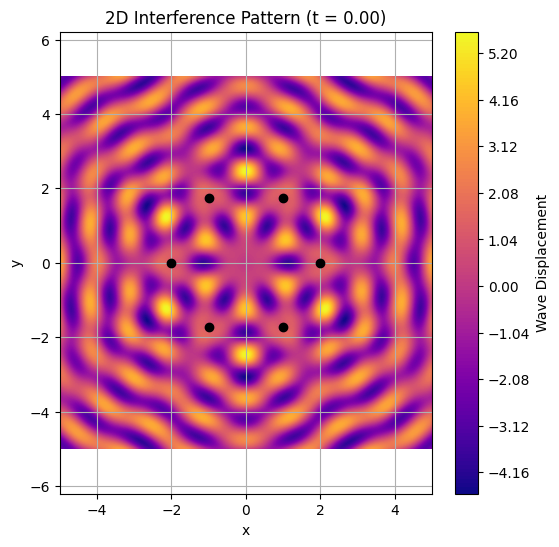
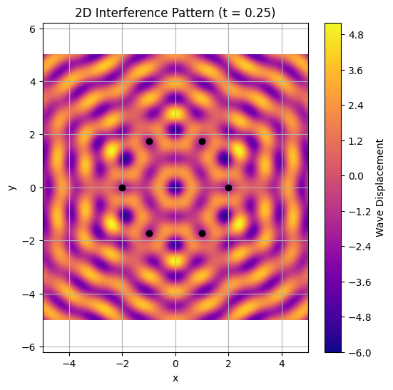
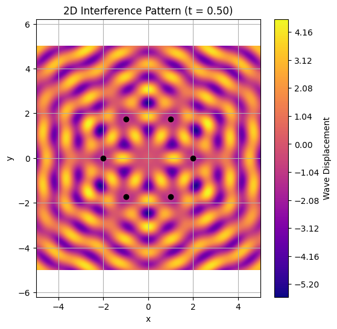
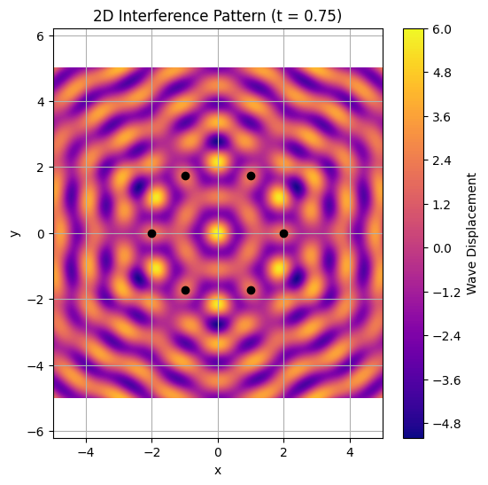
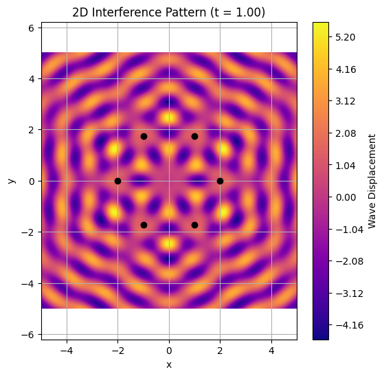
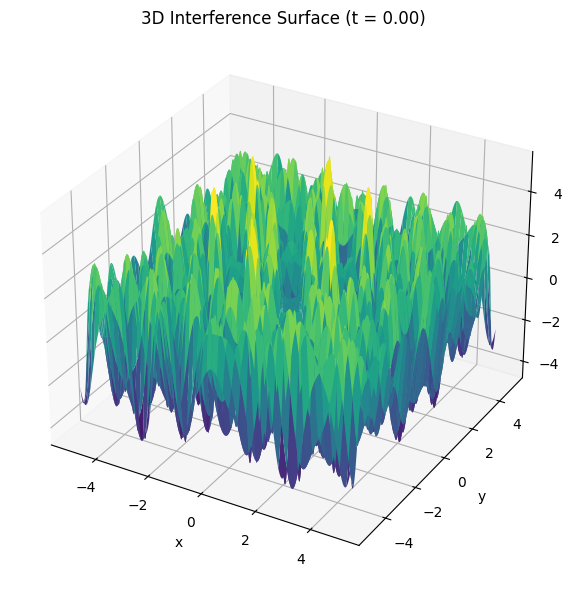

# Problem 1

## Interference Pattern from a Hexagonal Array of Wave Sources

---

### Motivation

Visualizing wave interference helps us understand fundamental concepts of physics like:

- **Superposition**: Waves add or cancel depending on their relative phase  
- **Coherence**: Stable phase relationships are key to recognizable patterns  
- **Symmetry in Physics**: The layout of sources creates geometrically rich structures  

When wave sources are arranged in a **regular hexagon**, the interference pattern becomes beautifully complex. These types of patterns are not just visually pleasing — they also appear in real-life systems like:

- Speaker arrays  
- Laser beam interference  
- Quantum interference experiments  
- Water ripple tanks in educational settings  

---

### Assumptions and Parameters

- All sources emit **circular, coherent waves** simultaneously  
- Identical parameters for all sources:  
  - Amplitude \( A = 1.0 \)  
  - Wavelength \( \lambda = 1.0 \)  
  - Frequency \( f = 1.0 \)  
- The layout is a **perfect regular hexagon**  
- The simulation is observed at different time steps \( t \in \{0, 0.25, 0.5, 0.75, 1.0\} \)  
- The superposition principle is used:  

  \[
  Z(x, y, t) = \sum_{i=1}^{N} A \sin(k r_i - \omega t + \phi)
  \]

---


### Simulation and Plotting (2D + 3D)

```python
import numpy as np
import matplotlib.pyplot as plt
# Wave Parameters
A = 1.0
wavelength = 1.0
k = 2 * np.pi / wavelength
omega = 2 * np.pi
phi = 0

# Grid Setup
x = np.linspace(-5, 5, 600)
y = np.linspace(-5, 5, 600)
X, Y = np.meshgrid(x, y)

# Generate hexagon sources
def generate_hexagon_sources(radius=2.0):
    N = 6
    angles = np.linspace(0, 2 * np.pi, N, endpoint=False)
    return [(radius * np.cos(a), radius * np.sin(a)) for a in angles]

# Plot 2D pattern at different times
def plot_2d_interference(t, cmap='plasma'):
    sources = generate_hexagon_sources()
    Z = np.zeros_like(X)
    for sx, sy in sources:
        r = np.sqrt((X - sx)**2 + (Y - sy)**2)
        Z += A * np.sin(k * r - omega * t + phi)

    plt.figure(figsize=(6, 6))
    plt.contourf(X, Y, Z, levels=150, cmap=cmap)
    for sx, sy in sources:
        plt.plot(sx, sy, 'ko')
    plt.title(f'2D Interference Pattern (t = {t:.2f})')
    plt.xlabel('x')
    plt.ylabel('y')
    plt.axis('equal')
    plt.colorbar(label='Wave Displacement')
    plt.grid(True)
    plt.show()

# Display multiple snapshots
for t_snapshot in [0, 0.25, 0.5, 0.75, 1.0]:
    plot_2d_interference(t_snapshot)

# Plot 3D Surface
def plot_3d_interference(t):
    sources = generate_hexagon_sources()
    Z = np.zeros_like(X)
    for sx, sy in sources:
        r = np.sqrt((X - sx)**2 + (Y - sy)**2)
        Z += A * np.sin(k * r - omega * t + phi)

    fig = plt.figure(figsize=(10, 6))
    ax = fig.add_subplot(111, projection='3d')
    ax.plot_surface(X, Y, Z, cmap='viridis', edgecolor='none')
    ax.set_title(f'3D Interference Surface (t = {t:.2f})')
    ax.set_xlabel('x')
    ax.set_ylabel('y')
    ax.set_zlabel('Amplitude')
    plt.tight_layout()
    plt.show()

# Show 3D plot at t=0
plot_3d_interference(t=0)
```












---

### Observations

- 🟢 **Constructive Interference**  
  Wave crests from different sources align, amplifying the total displacement (bright/elevated zones)

- 🔴 **Destructive Interference**  
  Crests and troughs cancel each other, resulting in near-zero displacement (dark/flat regions)

- 🔷 **Hexagonal Symmetry**  
  Clear 6-fold symmetry in wavefronts due to regular hexagon layout

- 🔄 **Temporal Dynamics**  
  As time evolves, the interference pattern shifts in space — simulating a breathing effect

---

### Conclusion

This simulation reveals the beauty and complexity of wave interference created by **coherent sources** arranged in a **hexagonal configuration**.

#### Key Takeaways:

- 📐 **Geometry defines interference** — the number and arrangement of sources directly shape the pattern  
- 📊 **Wavelength controls fringe spacing** — shorter wavelengths yield denser patterns  
- 🧠 **Simple wave rules → complex results** — a powerful concept in many physical systems

#### Explore Further:

- Use **triangular**, **square**, or **octagonal** source layouts  
- Introduce **phase differences** to simulate more realistic scenarios  
- Animate wave motion with `matplotlib.animation`  
- Apply this logic to **optics**, **acoustics**, or **quantum mechanics**

---

## ❓ Frequently Asked Questions (FAQ)

### ❓ Why a hexagon?
Hexagons provide rich symmetry and are seen in many physical systems like crystals and molecular patterns. Their layout creates circularly symmetric interference fringes.

### ❓ What if I change the polygon?
Using a triangle gives simpler results; squares lead to grid-like symmetry. The pattern complexity grows with the number of sides.

### ❓ Can this be animated?
Yes! You can create smooth animations by looping over `t` and redrawing each frame with `matplotlib.animation.FuncAnimation`.

### ❓ Are the waves realistic?
This model assumes idealized point sources in an infinite medium with perfect coherence. It demonstrates **concepts**, not specific real-world behavior.

### ❓ How can I simulate noise or non-coherence?
Introduce random phase offsets or amplitude differences per source.

### ❓ Can I use this for sound or light?
Yes — the math of wave interference applies to **any kind of wave**: sound, light, water, or even probability amplitudes in quantum systems.

---
