# Problem 1

## Interference Pattern from a Hexagonal Array of Wave Sources

---

### Motivation

Visualizing wave interference helps us understand fundamental concepts of physics like:

* **Superposition**: Waves add or cancel depending on their relative phase
* **Coherence**: Stable phase relationships are key to recognizable patterns
* **Symmetry in Physics**: The layout of sources creates geometrically rich structures

When wave sources are arranged in a **regular hexagon**, the interference pattern becomes beautifully complex. These types of patterns are not just visually pleasing — they also appear in real-life systems like:

* Speaker arrays
* Laser beam interference
* Quantum interference experiments
* Water ripple tanks in educational settings

---

### Assumptions and Parameters

* All sources emit **circular, coherent waves** simultaneously
* Identical parameters for all sources:

  * Amplitude $A = 1.0$
  * Wavelength $\lambda = 1.0$
  * Frequency $f = 1.0$
* The layout is a **perfect regular hexagon**
* The simulation includes comparisons with 1 and 2 sources for clarity
* Observed at time steps $t \in \{0, 0.25, 0.5, 0.75, 1.0\}$
* The superposition principle is used:

  $$
  Z(x, y, t) = \sum_{i=1}^{N} A \sin(k r_i - \omega t + \phi)
  $$

---

### Simulation and Plotting (1 Source, 2 Sources, 6 Sources)

```python
import numpy as np
import matplotlib.pyplot as plt
from matplotlib import animation
from IPython.display import Image

# Parameters
A = 1.0
wavelength = 1.0
k = 2 * np.pi / wavelength
omega = 2 * np.pi
phi = 0
x = np.linspace(-5, 5, 600)
y = np.linspace(-5, 5, 600)
X, Y = np.meshgrid(x, y)

# Source definitions
def generate_single_source():
    return [(0, 0)]

def generate_two_sources(sep=4.0):
    return [(-sep/2, 0), (sep/2, 0)]

def generate_hexagon_sources(radius=2.0):
    angles = np.linspace(0, 2 * np.pi, 6, endpoint=False)
    return [(radius * np.cos(a), radius * np.sin(a)) for a in angles]

# 2D Interference Plot
def plot_2d_interference(t, sources, title_suffix=""):
    Z = np.zeros_like(X)
    for sx, sy in sources:
        r = np.sqrt((X - sx)**2 + (Y - sy)**2)
        Z += A * np.sin(k * r - omega * t + phi)

    plt.figure(figsize=(6, 6))
    plt.contourf(X, Y, Z, levels=150, cmap='plasma')
    for sx, sy in sources:
        plt.plot(sx, sy, 'ko')
    plt.title(f"2D Interference Pattern {title_suffix} (t = {t:.2f})")
    plt.xlabel("x")
    plt.ylabel("y")
    plt.axis('equal')
    plt.colorbar(label='Wave Displacement')
    plt.grid(True)
    plt.show()

# Snapshots for each source layout
for t_snapshot in [0, 0.25, 0.5, 0.75, 1.0]:
    plot_2d_interference(t_snapshot, generate_single_source(), "(1 Source)")
    plot_2d_interference(t_snapshot, generate_two_sources(), "(2 Sources)")
    plot_2d_interference(t_snapshot, generate_hexagon_sources(), "(6 Sources)")
```

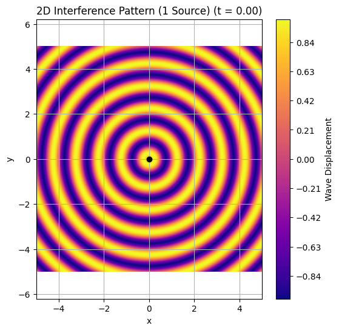

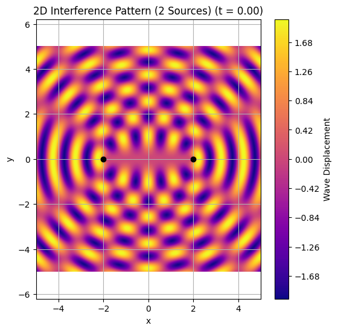


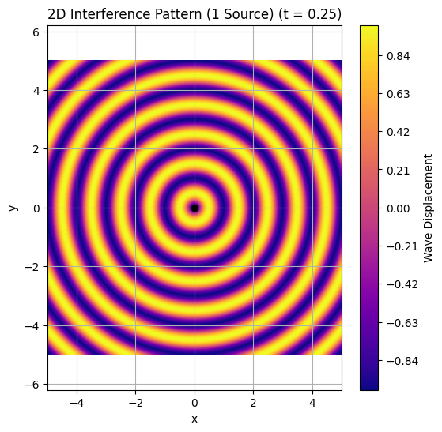

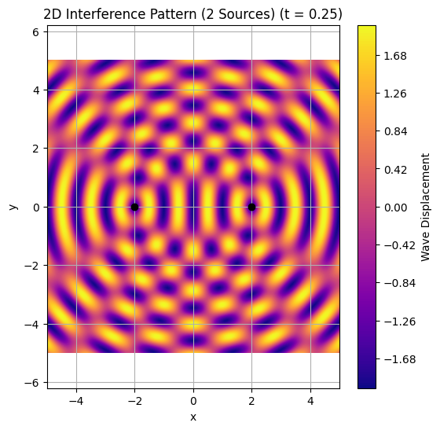

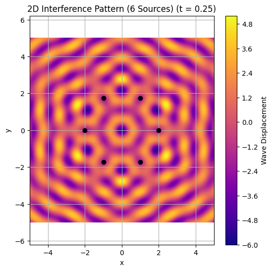

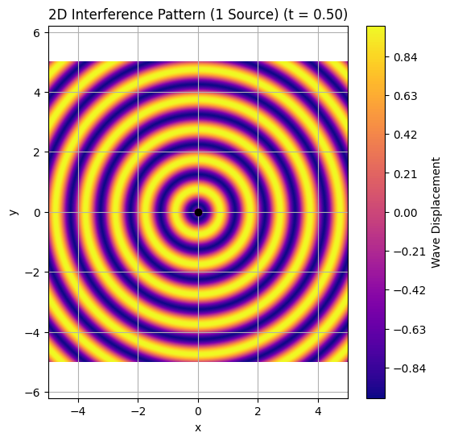


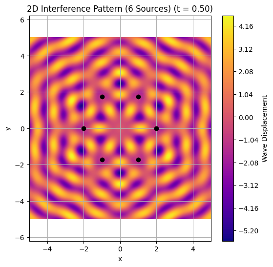

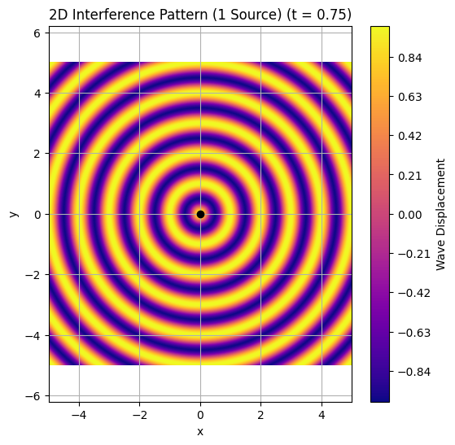

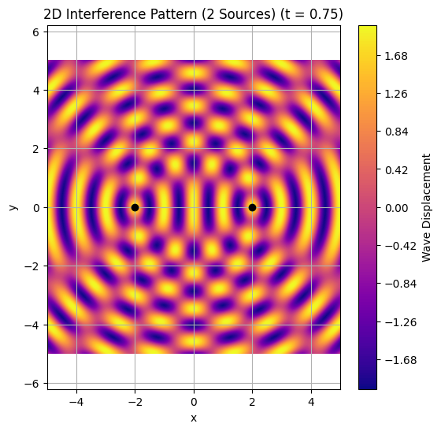

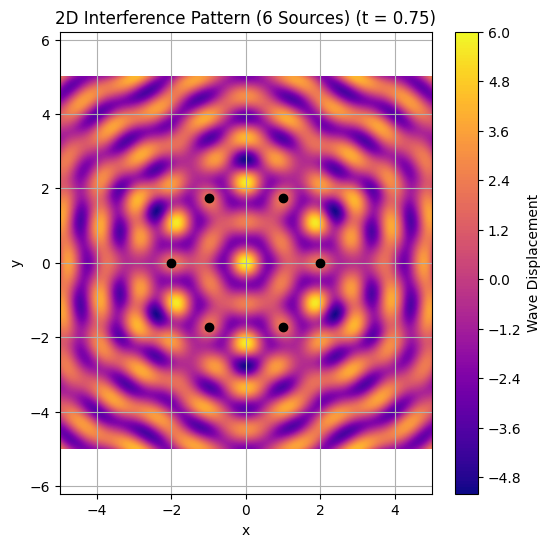


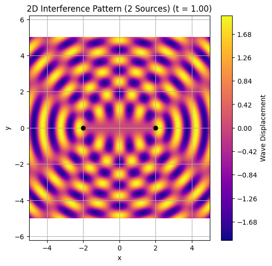

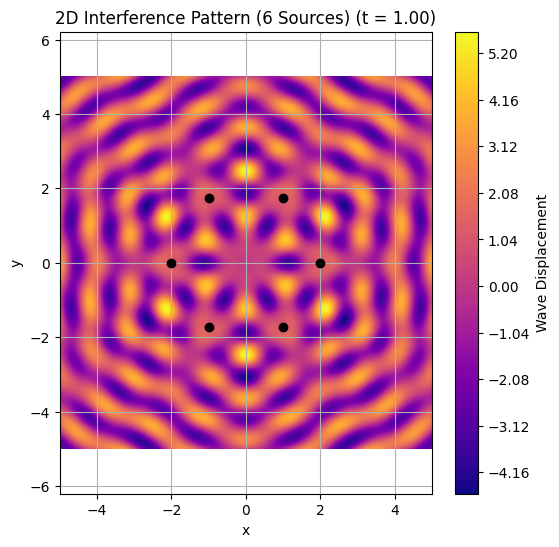
---

### 3D Interference Surface (Hexagonal Case)

```python
def plot_3d_interference(t, sources):
    from mpl_toolkits.mplot3d import Axes3D
    Z = np.zeros_like(X)
    for sx, sy in sources:
        r = np.sqrt((X - sx)**2 + (Y - sy)**2)
        Z += A * np.sin(k * r - omega * t + phi)

    fig = plt.figure(figsize=(10, 6))
    ax = fig.add_subplot(111, projection='3d')
    ax.plot_surface(X, Y, Z, cmap='viridis', edgecolor='none')
    ax.set_title(f'3D Interference Surface (t = {t:.2f})')
    ax.set_xlabel('x')
    ax.set_ylabel('y')
    ax.set_zlabel('Amplitude')
    plt.tight_layout()
    plt.show()

plot_3d_interference(0, generate_hexagon_sources())
```

---

### Animated GIF (Hexagon)

```python
def create_animation_gif(sources, filename="interference.gif", duration=2.0):
    fig, ax = plt.subplots(figsize=(6, 6))

    # İlk Z'yi hesapla ve vmin/vmax belirle
    t0 = 0
    Z0 = np.zeros_like(X)
    for sx, sy in sources:
        r = np.sqrt((X - sx)**2 + (Y - sy)**2)
        Z0 += A * np.sin(k * r - omega * t0 + phi)

    img = ax.imshow(Z0, cmap='plasma', origin='lower', extent=[-5, 5, -5, 5],
                    vmin=-len(sources), vmax=len(sources))

    ax.set_title("Interference Animation")
    ax.set_xlabel("x")
    ax.set_ylabel("y")

    def update(frame):
        t = frame / 20
        Z = np.zeros_like(X)
        for sx, sy in sources:
            r = np.sqrt((X - sx)**2 + (Y - sy)**2)
            Z += A * np.sin(k * r - omega * t + phi)
        img.set_data(Z)
        return [img]

    ani = animation.FuncAnimation(fig, update, frames=40, interval=duration*1000/40, blit=True)
    ani.save(filename, writer='pillow')
    plt.close()

create_animation_gif(generate_hexagon_sources())
ShowImage(filename="interference.gif")

```

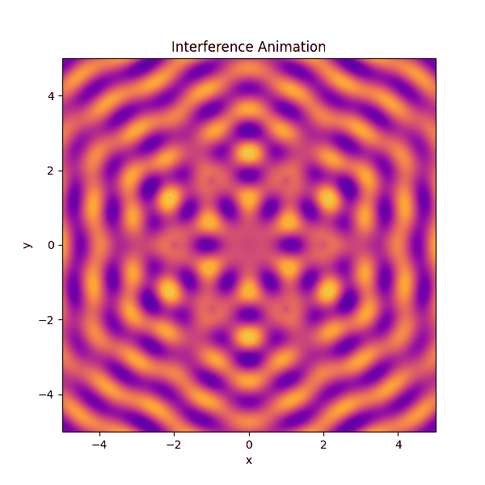

---

### Observations

* 🟢 **Constructive Interference**
  Wave crests align, creating bright/elevated zones

* 🔴 **Destructive Interference**
  Crests and troughs cancel, producing dark/flat regions

* 🔷 **Hexagonal Symmetry**
  The six-source layout reveals rich, six-fold symmetry

* 🔄 **Temporal Dynamics**
  The pattern evolves with time, creating a breathing effect

---

### Conclusion

This simulation reveals the beauty and complexity of wave interference from **coherent sources** arranged in geometric patterns. By exploring 1, 2, and 6 source cases, we observe how interference builds from simple to complex.

#### Key Takeaways:

* 📐 **Geometry defines interference**
* 📊 **Wavelength controls fringe spacing**
* 🧠 **Simple wave rules produce complex patterns**

#### Explore Further:

* Add triangular, square, or circular layouts
* Introduce phase offsets or noise
* Apply to optics, acoustics, or quantum wave interference

---

## ❓ Frequently Asked Questions (FAQ)

### ❓ Why include 1 and 2 sources?

To understand wave interference gradually, starting from the simplest case.

### ❓ Why a hexagon?

Hexagons offer natural symmetry and occur in crystals, molecular structures, and wave physics.

### ❓ Can this be animated?

Yes, via `matplotlib.animation` and `pillow` for exporting `.gif`.

### ❓ Are the waves realistic?

They represent idealized, perfectly coherent sources for conceptual clarity.

### ❓ How do I add non-coherence?

Add random phase differences or amplitude noise to each source.

---

[Open in Colab ↗](https://colab.research.google.com/drive/1HjFVy4r1IEFeyBXseTmDlUd5sAUiDMwB#scrollTo=QtLG-Pfw7aBt)
