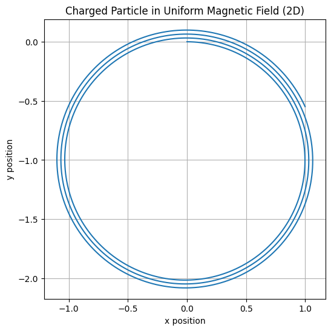
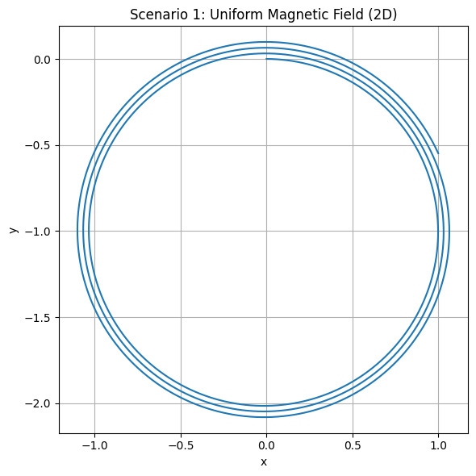
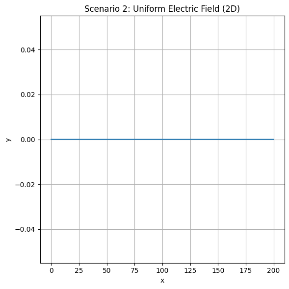
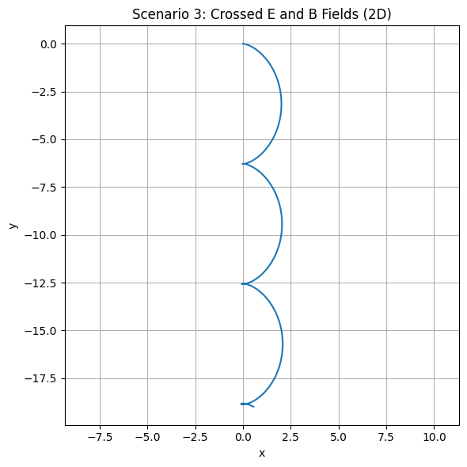
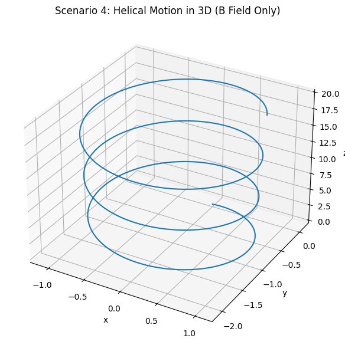

# Problem 1 (Advanced): Simulating the Effects of the Lorentz Force

---

## 🧠 Motivation

The **Lorentz force** governs how charged particles move through electric and magnetic fields. This law explains:

- Why particles spiral in magnetic traps  
- How beams are curved in cyclotrons  
- Why plasma drifts in crossed fields  

This simulation will help **visualize** these effects in multiple physical contexts.

---

## ⚙️ Lorentz Force Formula

\[
\vec{F} = q(\vec{E} + \vec{v} \times \vec{B})
\]

- \( \vec{F} \): Total electromagnetic force  
- \( q \): Particle charge  
- \( \vec{v} \): Velocity of the particle  
- \( \vec{E} \): Electric field  
- \( \vec{B} \): Magnetic field  

We’ll simulate the motion using Euler's method.

---

## 🔬 Simulation Setup (Python Code)

```python
import numpy as np
import matplotlib.pyplot as plt

# Parameters
q = 1.0
m = 1.0
dt = 0.01
steps = 2000

def simulate_lorentz(E, B, v0):
    r = np.zeros((steps, 3), dtype=float)
    v = v0.copy().astype(float)
    r[0] = np.array([0.0, 0.0, 0.0])
    for i in range(1, steps):
        F = q * (E + np.cross(v, B))
        a = F / m
        v += a * dt
        r[i] = r[i-1] + v * dt
    return r

# Example: only magnetic field
E = np.array([0.0, 0.0, 0.0])
B = np.array([0.0, 0.0, 1.0])
v0 = np.array([1.0, 0.0, 0.0])

trajectory = simulate_lorentz(E, B, v0)

plt.figure(figsize=(6, 6))
plt.plot(trajectory[:, 0], trajectory[:, 1])
plt.title("Charged Particle in Uniform Magnetic Field (2D)")
plt.xlabel("x position")
plt.ylabel("y position")
plt.axis("equal")
plt.grid(True)
plt.show()

```



---

## 🧲 Scenario 1: Only Magnetic Field (Uniform B, No E)

- Magnetic field: \( \vec{B} = [0, 0, 1] \)  
- No electric field  
- Initial velocity \( \vec{v}_0 = [1, 0, 0] \)

```python
E = np.array([0, 0, 0])
B = np.array([0, 0, 1])
v0 = np.array([1, 0, 0])
r1 = simulate_lorentz(E, B, v0)

plt.figure(figsize=(6, 6))
plt.plot(r1[:, 0], r1[:, 1])
plt.title("Scenario 1: Uniform Magnetic Field (2D)")
plt.xlabel("x")
plt.ylabel("y")
plt.axis("equal")
plt.grid(True)
plt.tight_layout()
plt.show()
```



---

### 🔍 Explanation:

- The particle undergoes **circular motion** in the x–y plane.
- The **Larmor radius** is constant, determined by velocity and field strength:
  \[
  r_L = \frac{mv}{|qB|} = 1 \text{ (in our units)}
  \]

---

## ⚡ Scenario 2: Only Electric Field (No B)

- Electric field: \( \vec{E} = [1, 0, 0] \)  
- No magnetic field  
- \( \vec{v}_0 = [0, 0, 0] \)

```python
E = np.array([1, 0, 0])
B = np.array([0, 0, 0])
v0 = np.array([0, 0, 0])
r2 = simulate_lorentz(E, B, v0)

plt.figure(figsize=(6, 6))
plt.plot(r2[:, 0], r2[:, 1])
plt.title("Scenario 2: Uniform Electric Field (2D)")
plt.xlabel("x")
plt.ylabel("y")
plt.grid(True)
plt.tight_layout()
plt.show()
```


---

### 🔍 Explanation:

- The particle accelerates **linearly** in the direction of the electric field (x-direction).
- This is classical Newtonian motion under a constant force:
  \[
  a = \frac{qE}{m}
  \]

---

## 🔁 Scenario 3: Crossed Electric and Magnetic Fields

- \( \vec{E} = [1, 0, 0] \)  
- \( \vec{B} = [0, 0, 1] \)  
- \( \vec{v}_0 = [0, 0, 0] \)

```python
E = np.array([1, 0, 0])
B = np.array([0, 0, 1])
v0 = np.array([0, 0, 0])
r3 = simulate_lorentz(E, B, v0)

plt.figure(figsize=(6, 6))
plt.plot(r3[:, 0], r3[:, 1])
plt.title("Scenario 3: Crossed E and B Fields (2D)")
plt.xlabel("x")
plt.ylabel("y")
plt.axis("equal")
plt.grid(True)
plt.tight_layout()
plt.show()
```



---

### 🔍 Explanation:

- The particle experiences a **drift** motion.
- Resulting velocity:
  \[
  \vec{v}_{\text{drift}} = \frac{\vec{E} \times \vec{B}}{B^2}
  \]
- This creates a **spiral drift** or “\( \vec{E} \times \vec{B} \)” drift.

---

## 🌀 Scenario 4: 3D Helical Motion

- Electric field: \( \vec{E} = [0, 0, 0] \)  
- Magnetic field: \( \vec{B} = [0, 0, 1] \)  
- Initial velocity: \( \vec{v}_0 = [1, 0, 1] \)

```python
from mpl_toolkits.mplot3d import Axes3D

E = np.array([0, 0, 0])
B = np.array([0, 0, 1])
v0 = np.array([1, 0, 1])
r4 = simulate_lorentz(E, B, v0)

fig = plt.figure(figsize=(8, 6))
ax = fig.add_subplot(111, projection='3d')
ax.plot3D(r4[:, 0], r4[:, 1], r4[:, 2])
ax.set_title("Scenario 4: Helical Motion in 3D (B Field Only)")
ax.set_xlabel("x")
ax.set_ylabel("y")
ax.set_zlabel("z")
plt.tight_layout()
plt.show()
```



---

### 🔍 Explanation:

- The particle spirals along the z-direction due to its initial vertical velocity.
- The **pitch** of the helix depends on \( v_z \).

---

## 📊 Parameter Exploration Summary

| Scenario | Fields            | Initial Velocity     | Resulting Motion       |
|----------|-------------------|----------------------|------------------------|
| 1        | \( \vec{B} \neq 0 \) only | \( [1, 0, 0] \)        | Circular (2D)         |
| 2        | \( \vec{E} \neq 0 \) only | \( [0, 0, 0] \)        | Linear acceleration   |
| 3        | Crossed \( \vec{E}, \vec{B} \) | \( [0, 0, 0] \)        | Drift motion          |
| 4        | \( \vec{B} \neq 0 \), 3D  | \( [1, 0, 1] \)        | Helical motion (3D)   |

---

## ❓ Frequently Asked Questions (FAQ)

### 💡 Why is the motion circular in a magnetic field?
Because the force is always perpendicular to the velocity → centripetal motion.

### 💡 What happens if fields are non-uniform?
Motion becomes highly complex — chaotic or trapped depending on gradients.

### 💡 Is this used in real applications?
Yes, in devices like:
- **Mass spectrometers**
- **Cyclotrons**
- **Tokamaks (fusion)**

### 💡 What’s next for deeper simulations?
- Use **Runge-Kutta** for more accuracy  
- Include **field gradients** or **collisions**

---

## ✅ Final Remarks

This simulation demonstrates how the Lorentz force governs particle dynamics in multiple fields. Through graphical representation and parameter exploration, we can see how fundamental electromagnetic principles manifest in real-world physics.

