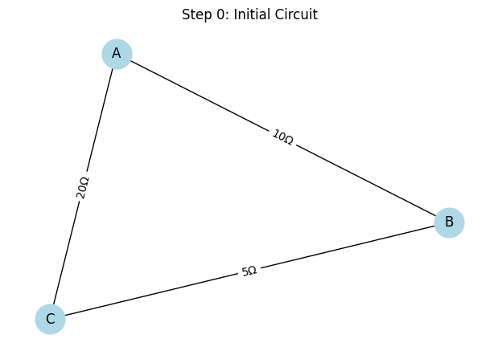
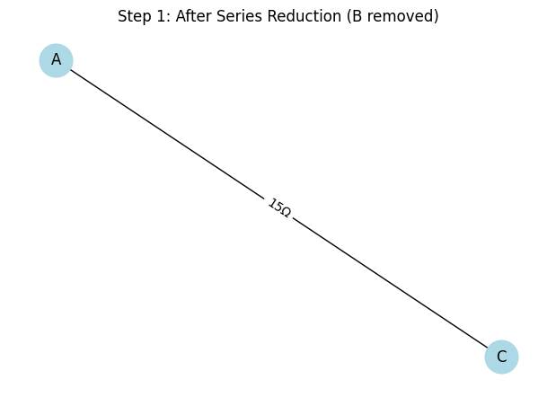
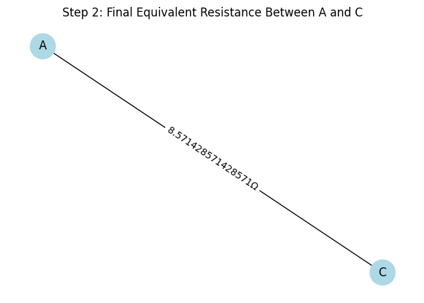

# Problem 1: Equivalent Resistance Using Graph Theory

---

## 🧠 Motivation

In complex electrical circuits, manual simplification using series/parallel rules becomes inefficient. Graph theory provides an elegant, visual solution by treating:

- Nodes as junctions
- Edges as resistors (with weight = resistance in ohms)

This simulation shows how a circuit is reduced step-by-step using Python and `networkx`.


---

## 🔌 Define and Visualize Initial Circuit

```python
def draw_circuit(G, title):
    pos = nx.spring_layout(G, seed=42)
    labels = nx.get_edge_attributes(G, 'resistance')
    plt.figure(figsize=(6, 4))
    nx.draw(G, pos, with_labels=True, node_color='lightblue', node_size=700)
    nx.draw_networkx_edge_labels(G, pos, edge_labels={k: f"{v}Ω" for k, v in labels.items()})
    plt.title(title)
    plt.axis('off')
    plt.tight_layout()
    plt.show()

# Initial circuit: A–B (10Ω), B–C (5Ω), A–C (20Ω)
G = nx.Graph()
G.add_edge('A', 'B', resistance=10)
G.add_edge('B', 'C', resistance=5)
G.add_edge('A', 'C', resistance=20)

draw_circuit(G, "Step 0: Initial Circuit")
```


---

## 🔄 Step 1: Series Reduction (A–B–C)

- Node **B** is between **A and C** with degree 2 → series rule applies.
- Combine:  
  \[
  R_{AB} + R_{BC} = 10Ω + 5Ω = 15Ω
  \]

```python
G.remove_node('B')
G.add_edge('A', 'C', resistance=15)  # Now A–C has 15Ω and 20Ω in parallel

draw_circuit(G, "Step 1: After Series Reduction (B removed)")
```


---

## ♻️ Step 2: Parallel Reduction (A–C)

- Two edges between **A–C**: 15Ω and 20Ω
- Use formula:  
  \[
  \frac{1}{R_{eq}} = \frac{1}{15} + \frac{1}{20} = \frac{7}{60} → R_{eq} ≈ 8.57Ω
  \]

```python
# Manually remove both and replace with equivalent
G.remove_edges_from(list(G.edges()))
G.add_edge('A', 'C', resistance=1 / (1/15 + 1/20))

draw_circuit(G, "Step 2: Final Equivalent Resistance Between A and C")
```



---

## ✅ Final Result

\[
\boxed{R_{eq} \approx 8.57\, \Omega}
\]

---

## 📈 Analysis Summary

- Step 0: Triangle network
- Step 1: Simplified using **series rule**
- Step 2: Final reduction with **parallel rule**
- Graphically tracked each step

---

## ❓ Frequently Asked Questions (FAQ)

### 💡 Can this work with bigger graphs?
Yes, but you'd need to add logic to automatically detect series/parallel structures and optionally use Δ–Y transformations.

### 💡 Why use `networkx`?
It simplifies circuit graph creation, traversal, and visualization.

### 💡 Can I use MultiGraph?
Yes, for actual parallel edges `nx.MultiGraph()` is better, but here we simulate it manually.

### 💡 Can I visualize more steps?
Absolutely. Each reduction step can be visualized with `draw_circuit()` after each transformation.

---

