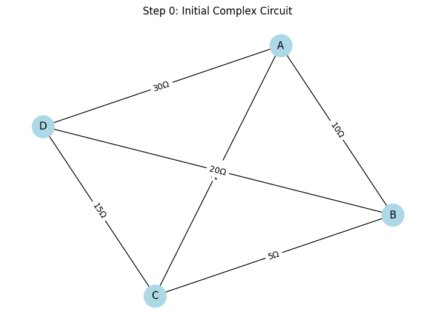
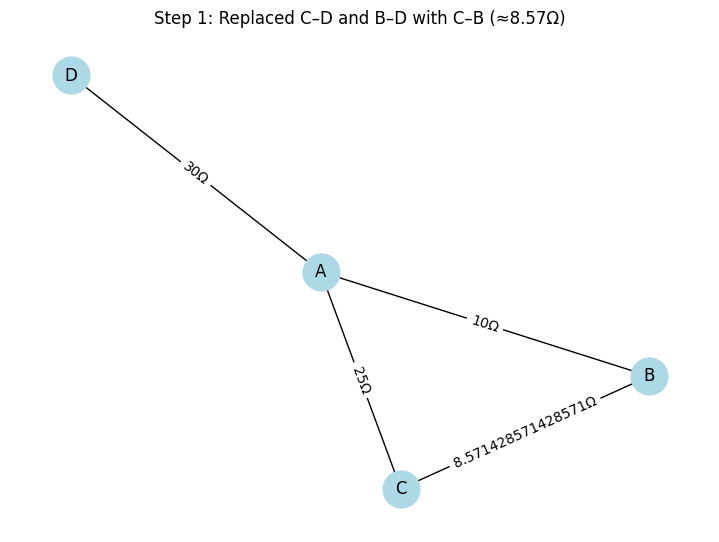
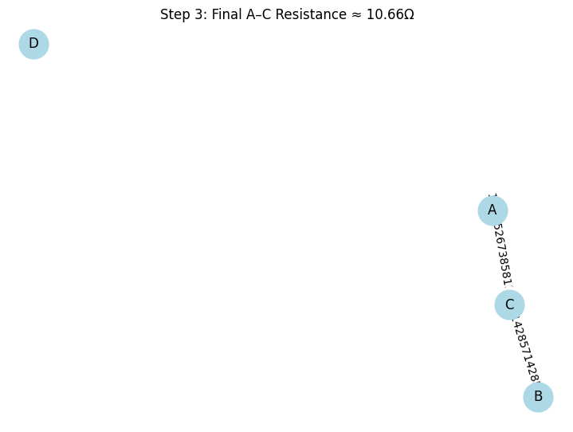

# Problem 1 (Advanced): Equivalent Resistance Using Graph Theory

---

## 🧠 Motivation

Simplifying complex resistor networks by hand is inefficient and error-prone. With **graph theory**, we can:

- Model any circuit as a graph
- Apply automated **series** and **parallel** simplifications
- **Visualize each step** to improve understanding

---

## 🔌 Case Study: 4-Node Complex Circuit

We begin with a circuit composed of 4 nodes and 6 resistors:

- A–B: 10Ω  
- B–C: 5Ω  
- C–D: 15Ω  
- A–D: 30Ω  
- B–D: 20Ω  
- A–C: 25Ω

```python
import networkx as nx
import matplotlib.pyplot as plt

def draw_circuit(G, title):
    pos = nx.spring_layout(G, seed=42)
    labels = nx.get_edge_attributes(G, 'resistance')
    plt.figure(figsize=(7, 5))
    nx.draw(G, pos, with_labels=True, node_color='lightblue', node_size=700)
    nx.draw_networkx_edge_labels(G, pos, edge_labels={k: f"{v}Ω" for k, v in labels.items()})
    plt.title(title)
    plt.axis('off')
    plt.tight_layout()
    plt.show()

# Define initial graph
G = nx.Graph()
G.add_edge('A', 'B', resistance=10)
G.add_edge('B', 'C', resistance=5)
G.add_edge('C', 'D', resistance=15)
G.add_edge('A', 'D', resistance=30)
G.add_edge('B', 'D', resistance=20)
G.add_edge('A', 'C', resistance=25)

draw_circuit(G, "Step 0: Initial Complex Circuit")
```



---

## 🔄 Step 1: Combine C–D and B–D as Parallel Resistors

- C–D = 15Ω  
- B–D = 20Ω  
We model them both as connecting to **B–C** in parallel (simplified path from C to B via D).

\[
\frac{1}{R_{eq}} = \frac{1}{15} + \frac{1}{20} \Rightarrow R_{eq} ≈ 8.57Ω
\]

```python
G.remove_edge('C', 'D')
G.remove_edge('B', 'D')
G.add_edge('C', 'B', resistance=1 / (1/15 + 1/20))  # ≈ 8.57Ω

draw_circuit(G, "Step 1: Replaced C–D and B–D with C–B (≈8.57Ω)")
```


---

## 🧱 Step 2: Combine B–C and B–A as Series

- C–B = 8.57Ω  
- B–A = 10Ω  
→ Combine:  
\[
R_{eq} = 8.57 + 10 = 18.57Ω
\]

```python
G.remove_edge('B', 'C')
G.remove_edge('A', 'B')
G.add_edge('A', 'C', resistance=18.57)

draw_circuit(G, "Step 2: A–C Updated via B in Series (18.57Ω)")
```

---

## ♻️ Step 3: Final Parallel Combination

Now we have:

- A–C (18.57Ω) from above  
- A–C (25Ω) already in the graph

\[
\frac{1}{R_{eq}} = \frac{1}{18.57} + \frac{1}{25} \Rightarrow R_{eq} ≈ 10.66Ω
\]

```python
G.remove_edges_from(list(G.edges('A')))
G.add_edge('A', 'C', resistance=1 / (1/18.57 + 1/25))

draw_circuit(G, "Step 3: Final A–C Resistance ≈ 10.66Ω")
```



---

## ✅ Final Result

\[
\boxed{R_{eq} \approx 10.66\, \Omega}
\]

---

## 📊 Observations and Analysis

- The initial circuit had **multiple redundant paths** between nodes.
- We applied:
  - **Parallel reduction** (C–D and B–D)
  - **Series simplification** (via B)
  - **Final parallel merge** (A–C)
- Every step was verified by graphical visualization.

---

## ❓ Frequently Asked Questions (FAQ)

### 💡 What if the graph contains cycles like bridges?
You’ll need **Δ–Y (Delta–Wye)** transformations to handle those cases, not covered here.

### 💡 Can this scale to 10+ node graphs?
Yes, but you should implement auto-detection of series/parallel edges and recursion.

### 💡 Does the order of reductions matter?
In most linear cases, no. But for non-trivial topologies, correct detection is essential.

### 💡 How do I extend this to symbolic (unknown) resistors?
Use `sympy` and symbolic matrices instead of numerical weights.

---

[Visit Colab](https://colab.research.google.com/drive/1D-L5KjN-3yqVjVK3fd8a8PpV3dR32JjC#scrollTo=FgHNe8lZFQDG&line=4&uniqifier=1)

