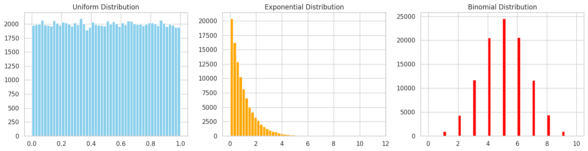
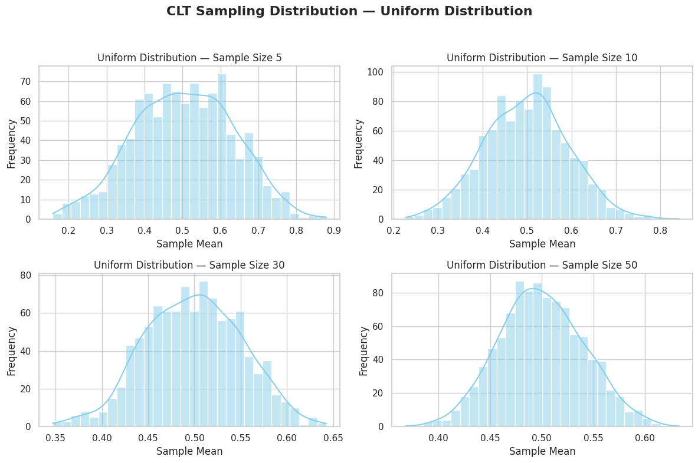
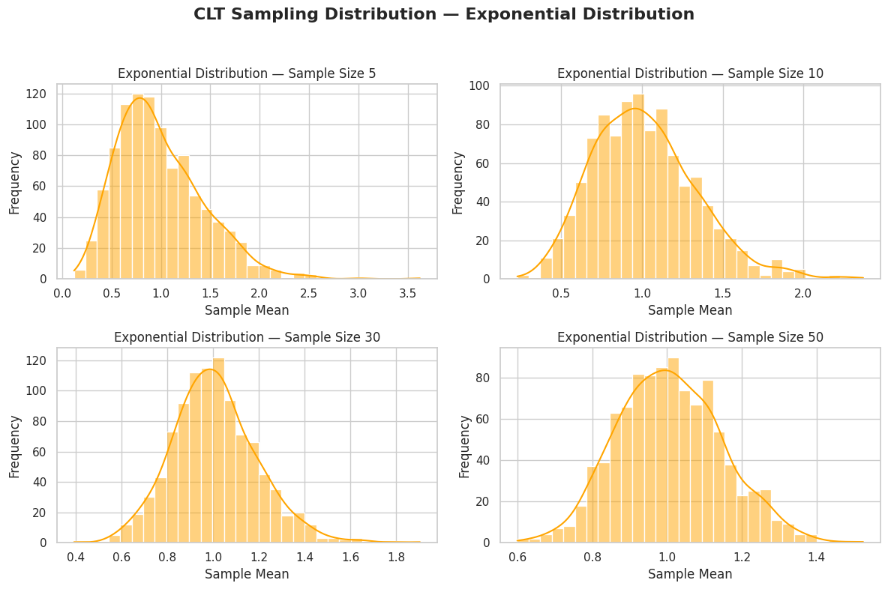
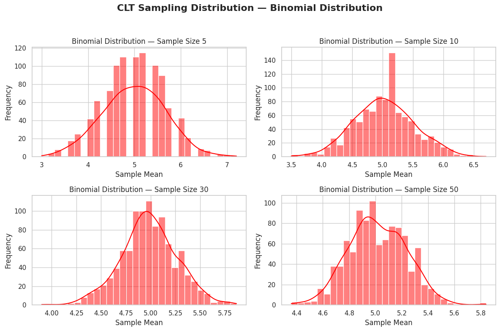
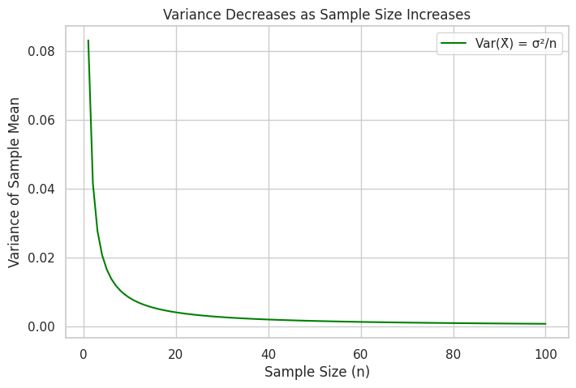

# 📊 Central Limit Theorem — Simulation & Visualization in Python

## 🎯 Objective

Demonstrate the **Central Limit Theorem (CLT)** through simulations on different population distributions and visualize how the distribution of the sample mean becomes normal as the sample size increases.

---

## 📖 What is the Central Limit Theorem?

> The **Central Limit Theorem** (CLT) states:
> Even if a population is not normally distributed, the distribution of the **sample means** tends to be approximately **normal** if the sample size is sufficiently large.

**Why is this important?**
- It allows us to apply normal distribution logic in hypothesis testing.
- It enables confidence interval estimation.
- It justifies using z-scores and t-scores even when the original data isn't normal.

📘 **Formula for the standard error (spread of sample means):**

$$
\sigma_{\bar{x}} = \frac{\sigma}{\sqrt{n}}
$$


---

---

## 🧪 Step 1: Create and Summarize Populations

We generate three populations to simulate:
- **Uniform Distribution**: Every value between 0 and 1 is equally likely.
- **Exponential Distribution**: Highly right-skewed, models waiting times.
- **Binomial Distribution**: Discrete 0 or 1 (like success/failure), here with 10 trials and 0.5 probability.

```python
np.random.seed(42)
N = 100_000

uniform_pop = np.random.uniform(0, 1, N)
exponential_pop = np.random.exponential(scale=1.0, size=N)
binomial_pop = np.random.binomial(n=10, p=0.5, size=N)

# Print summary
print("\U0001F4CA Population Summary:")
for name, pop in zip(["Uniform", "Exponential", "Binomial"], [uniform_pop, exponential_pop, binomial_pop]):
    print(f"\n→ {name} Distribution:")
    print(f"   Mean     : {np.mean(pop):.3f}")
    print(f"   Variance : {np.var(pop):.3f}")

# Plot histograms of populations
plt.figure(figsize=(15, 4))
for i, (title, data, color) in enumerate(zip(
    ["Uniform", "Exponential", "Binomial"],
    [uniform_pop, exponential_pop, binomial_pop],
    ['skyblue', 'orange', 'red']
)):
    plt.subplot(1, 3, i+1)
    plt.hist(data, bins=50, color=color)
    plt.title(f"{title} Distribution")
plt.tight_layout()
plt.show()
```

📊 Population Summary:

→ Uniform Distribution:
   Mean     : 0.499
   Variance : 0.083

→ Exponential Distribution:
   Mean     : 1.005
   Variance : 1.008

→ Binomial Distribution:
   Mean     : 5.004
   Variance : 2.504



---

## 📈 Step 2: Sampling and Distribution of Sample Means

This function:
- Takes multiple samples from a population
- Computes the sample means
- Plots the histogram of the means

```python
def plot_sampling_distribution(population, dist_name, color):
    sample_sizes = [5, 10, 30, 50]
    num_samples = 1000

    plt.figure(figsize=(12, 8))
    for i, n in enumerate(sample_sizes):
        sample_means = [
            np.mean(np.random.choice(population, size=n, replace=False))
            for _ in range(num_samples)
        ]
        plt.subplot(2, 2, i+1)
        sns.histplot(sample_means, kde=True, bins=30, color=color)
        plt.title(f"{dist_name} — Sample Size {n}", fontsize=12)
        plt.xlabel("Sample Mean")
        plt.ylabel("Frequency")

    plt.suptitle(f"CLT Sampling Distribution — {dist_name}", fontsize=16, weight="bold")
    plt.tight_layout(rect=[0, 0, 1, 0.95])
    plt.show()
```

---

## 🔬 Step 3: Simulation Results by Distribution

### ▶️ Uniform Distribution

```python
plot_sampling_distribution(uniform_pop, "Uniform Distribution", color="skyblue")
```



📘 **Uniform Distribution:** All values between 0 and 1 are equally likely. The population is flat.

🧠 **Observation:** Despite the flat shape of the population, the sampling distribution becomes bell-shaped as the sample size increases.

---

### ▶️ Exponential Distribution

```python
plot_sampling_distribution(exponential_pop, "Exponential Distribution", color="orange")
```



📘 **Exponential Distribution:** Right-skewed, often used to model time between rare events.

🧠 **Observation:** Initially skewed, but the sampling mean distribution becomes symmetric and normal-looking with larger samples.

---

### ▶️ Binomial Distribution

```python
plot_sampling_distribution(binomial_pop, "Binomial Distribution", color="red")
```



📘 **Binomial Distribution:** Discrete distribution, modeling the number of successes in a series of Bernoulli trials.

🧠 **Observation:** Even a discrete distribution like binomial approaches a normal distribution in its sample means.

---

## 📉 Step 4: Variance of the Sample Mean vs Sample Size

The variance of the sample mean decreases as sample size increases:

```python
sizes = np.arange(1, 101)
uniform_var = np.var(uniform_pop)
variances = [uniform_var / n for n in sizes]

plt.figure(figsize=(8,5))
plt.plot(sizes, variances, label='Var(X̄) = σ²/n', color='green')
plt.xlabel('Sample Size (n)')
plt.ylabel('Variance of Sample Mean')
plt.title('Variance Decreases as Sample Size Increases')
plt.legend()
plt.grid(True)
plt.show()
```


📘 **Key Formula:**

$$
\text{Var}(\bar{X}) = \frac{\sigma^2}{n}
$$


As sample size increases, the **spread** of the sample mean distribution **shrinks**, making estimates more precise.

---

## 💼 Real-World Applications of CLT

| Application        | Description |
|--------------------|-------------|
| **Polling**        | Estimate election results from survey samples. |
| **Quality Control**| Monitor product consistency in factories. |
| **Finance**        | Predict average portfolio returns. |
| **Medicine**       | Evaluate treatment effectiveness across sample groups. |
| **Tech A/B Testing**| Assess conversion rates between web design variations. |

---

## ✅ Conclusion

- CLT is powerful because it works with **any distribution**.
- Larger sample sizes make the sampling distribution **more normal**.
- This is why normal distribution is so common in real data.

---

## 🧠 Key Takeaways

- CLT justifies statistical inference in real life.
- Sample size plays a critical role in **normality of sample means**.
- Visualization helps understand abstract statistical laws.

---

[Visit Colab](https://colab.research.google.com/drive/1AqZp6He27r2g35L7x-La4TO19ZyJtbpP?usp=sharing)