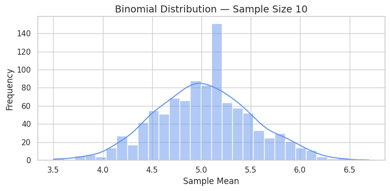

# 📊 Central Limit Theorem — Simulation & Visualization in Python

## 🎯 Objective

Demonstrate the **Central Limit Theorem (CLT)** through simulations on different population distributions.

---

## 📖 What is the Central Limit Theorem?

The Central Limit Theorem states:

> Given a population with any distribution, the sampling distribution of the sample mean approaches a **normal distribution** as the sample size increases.

Key points:
- Works even when the population distribution is non-normal.
- The larger the sample size, the better the approximation.
- Standard deviation of sample means:  
  \[\sigma_{\bar{x}} = \frac{\sigma}{\sqrt{n}}\]

---


---

## 🧪 Step 1: Create and Summarize Populations

We will generate populations from three different distributions:

- **Uniform Distribution**: Continuous, flat.
- **Exponential Distribution**: Right-skewed.
- **Binomial Distribution**: Discrete, symmetric.

```python
# Set random seed for reproducibility
np.random.seed(42)

# Population size
N = 100_000

# Create populations
uniform_pop = np.random.uniform(0, 1, N)
exponential_pop = np.random.exponential(scale=1.0, size=N)
binomial_pop = np.random.binomial(n=10, p=0.5, size=N)

# Print summary statistics
print("\U0001F4CA Population Summary:")
print("\n\u27A1️ Uniform Distribution:")
print(f"   Mean     : {np.mean(uniform_pop):.3f}")
print(f"   Variance : {np.var(uniform_pop):.3f}")

print("\n\u27A1️ Exponential Distribution:")
print(f"   Mean     : {np.mean(exponential_pop):.3f}")
print(f"   Variance : {np.var(exponential_pop):.3f}")

print("\n\u27A1️ Binomial Distribution:")
print(f"   Mean     : {np.mean(binomial_pop):.3f}")
print(f"   Variance : {np.var(binomial_pop):.3f}")

# Plot histograms for visual verification
plt.figure(figsize=(15, 4))

plt.subplot(1, 3, 1)
plt.hist(uniform_pop, bins=50, color='skyblue')
plt.title("Uniform")

plt.subplot(1, 3, 2)
plt.hist(exponential_pop, bins=50, color='lightgreen')
plt.title("Exponential")

plt.subplot(1, 3, 3)
plt.hist(binomial_pop, bins=50, color='salmon')
plt.title("Binomial")

plt.tight_layout()
plt.show()
```
📊 Population Summary:

➡️ Uniform Distribution:
   Mean     : 0.499
   Variance : 0.083

➡️ Exponential Distribution:
   Mean     : 1.005
   Variance : 1.008

➡️ Binomial Distribution:
   Mean     : 5.004
   Variance : 2.504


---

## 📈 Step 2: Sampling and Distribution of Sample Means

We define a function to:
- Take multiple samples from a population,
- Compute the sample means,
- Plot the distribution of sample means for various sample sizes.

```python
def plot_sampling_distribution(population, dist_name):
    sample_sizes = [5, 10, 30, 50]
    num_samples = 1000

    for n in sample_sizes:
        sample_means = [
            np.mean(np.random.choice(population, size=n, replace=False))
            for _ in range(num_samples)
        ]

        plt.figure(figsize=(8, 4))
        sns.histplot(sample_means, kde=True, bins=30, color="cornflowerblue")
        plt.title(f"{dist_name} — Sample Size {n}", fontsize=14)
        plt.xlabel("Sample Mean")
        plt.ylabel("Frequency")
        plt.tight_layout()
        plt.show()
```

---

## 🔬 Step 3: Run Simulations for Each Population

```python
plot_sampling_distribution(uniform_pop, "Uniform Distribution")
plot_sampling_distribution(exponential_pop, "Exponential Distribution")
plot_sampling_distribution(binomial_pop, "Binomial Distribution")
```





---

## 💼 Real-World Applications of CLT

| Application        | Description |
|--------------------|-------------|
| **Polling**        | Estimate election results from survey samples. |
| **Quality Control**| Monitor average product dimensions in factories. |
| **Finance**        | Forecast average returns of portfolios. |
| **Medicine**       | Compare treatment effectiveness via patient samples. |

---

## ✅ Conclusion

- The CLT applies across various population shapes: continuous, discrete, skewed.
- The distribution of the **sample mean** becomes **normal** as sample size increases.
- This foundational principle allows us to use **normal-based inference** in most fields.

---

## 🧠 Key Takeaways

- The **Central Limit Theorem** enables reliable inference from samples.
- With **larger samples**, the **sampling distribution** becomes tighter and more normal.
- This is why the **normal distribution** is central in statistical methods.

---
