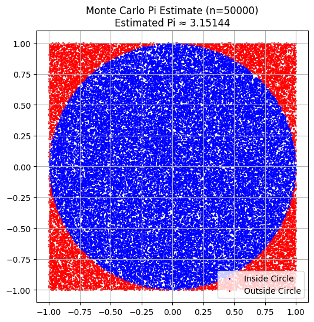

# 🎯 Problem 2: Estimating Pi using Monte Carlo Methods

## 📌 Part 1: Estimating Pi using a Circle

### 📖 Theoretical Foundation

The idea is based on the ratio of areas:
- A **unit circle** has radius 1, so its area is \( \pi r^2 = \pi \).
- A square bounding this circle (from -1 to 1 in x and y) has area 4.

If we randomly throw points into the square, the ratio of points that fall inside the circle will be approximately equal to the ratio of the areas:

\[ \frac{\text{Points in Circle}}{\text{Total Points}} \approx \frac{\pi}{4} \Rightarrow \pi \approx 4 \cdot \frac{\text{Points in Circle}}{\text{Total Points}} \]

### 🐍 Python Code – Simulation and Visualization

```python
import numpy as np
import matplotlib.pyplot as plt

# Set random seed
np.random.seed(42)

# Function to estimate Pi and visualize
def estimate_pi(num_points):
    x = np.random.uniform(-1, 1, num_points)
    y = np.random.uniform(-1, 1, num_points)
    
    distances = x**2 + y**2
    inside = distances <= 1
    
    pi_estimate = 4 * np.sum(inside) / num_points

    # Visualization
    plt.figure(figsize=(6,6))
    plt.scatter(x[inside], y[inside], color='blue', s=1, label='Inside Circle')
    plt.scatter(x[~inside], y[~inside], color='red', s=1, label='Outside Circle')
    plt.gca().set_aspect('equal')
    plt.title(f"Monte Carlo Pi Estimate (n={num_points})\nEstimated Pi ≈ {pi_estimate:.5f}")
    plt.legend()
    plt.grid(True)
    plt.show()

    return pi_estimate
```

### ▶️ Example: Estimating Pi with 10,000 points

```python
estimate_pi(10000)
```

---

## 📊 Part 1 Analysis – Convergence of Estimation

We now check how the estimate improves with more points.

```python
sample_sizes = [100, 1000, 5000, 10000, 50000, 100000, 500000]
pi_estimates = [estimate_pi(n) for n in sample_sizes]

plt.figure(figsize=(10,5))
plt.plot(sample_sizes, pi_estimates, marker='o', linestyle='-', label='Estimated Pi')
plt.axhline(np.pi, color='green', linestyle='--', label='Actual Pi')
plt.xscale('log')
plt.xlabel('Number of Points (log scale)')
plt.ylabel('Estimated Pi')
plt.title('Convergence of Pi Estimation using Monte Carlo')
plt.legend()
plt.grid(True)
plt.show()
```





🧠 **Observation:**
- The more points we use, the closer we get to the true value of \( \pi \).
- However, convergence is **slow** – doubling the number of points gives marginal improvement.

---

## 📌 Part 2: Estimating Pi using Buffon's Needle

### 📖 Theoretical Foundation

Buffon's Needle is a probability problem involving dropping a needle of length \( L \) onto a floor with parallel lines spaced distance \( D \) apart (\( L \leq D \)).

The probability that the needle crosses a line is:

\[ P = \frac{2L}{\pi D} \Rightarrow \pi \approx \frac{2L \cdot N}{D \cdot H} \]

Where:
- \( N \): number of throws
- \( H \): number of hits (needle crosses a line)

### 🐍 Python Code – Buffon’s Needle Simulation

```python
def buffon_needle_simulation(N, L=1.0, D=2.0):
    hits = 0
    x_positions = []
    angles = []
    crossed = []

    for _ in range(N):
        x_center = np.random.uniform(0, D/2)
        angle = np.random.uniform(0, np.pi/2)

        x_positions.append(x_center)
        angles.append(angle)

        if x_center <= (L/2) * np.sin(angle):
            hits += 1
            crossed.append(True)
        else:
            crossed.append(False)

    if hits == 0:
        return None  # Avoid division by zero

    pi_estimate = (2 * L * N) / (D * hits)

    # Visualization
    plt.figure(figsize=(8, 6))
    for i in range(N):
        x = x_positions[i]
        theta = angles[i]
        x0 = x - (L/2) * np.cos(theta)
        x1 = x + (L/2) * np.cos(theta)
        y0 = i % 50
        y1 = y0 + np.sin(theta) * L
        color = 'red' if crossed[i] else 'gray'
        plt.plot([x0, x1], [y0, y1], color=color, linewidth=0.8)

    for line in np.arange(0, 10, D):
        plt.axvline(line, color='black', linestyle='--', alpha=0.4)

    plt.title(f"Buffon's Needle Simulation (N={N})\nEstimated Pi ≈ {pi_estimate:.5f}")
    plt.xlabel("x")
    plt.ylabel("y")
    plt.grid(True)
    plt.show()

    return pi_estimate
```

### ▶️ Example: Estimating Pi with Buffon's Needle

```python
buffon_needle_simulation(5000)
```


---

## 📊 Part 2 Analysis – Convergence of Estimation

```python
sample_sizes = [100, 500, 1000, 5000, 10000, 20000]
needle_estimates = [buffon_needle_simulation(n) for n in sample_sizes]

plt.figure(figsize=(10,5))
plt.plot(sample_sizes, needle_estimates, marker='o', linestyle='-', label="Estimated Pi")
plt.axhline(np.pi, color='green', linestyle='--', label='Actual Pi')
plt.xlabel("Number of Needle Drops")
plt.ylabel("Estimated Pi")
plt.title("Convergence of Pi Estimation via Buffon's Needle")
plt.legend()
plt.grid(True)
plt.show()
```


🧠 **Observation:**
- Buffon’s method is elegant but **noisier**.
- Requires significantly more simulations for stable convergence.

---

## ⚖️ Comparison: Circle vs Buffon’s Needle

| Method             | Convergence Speed | Visual Clarity | Complexity |
|--------------------|------------------|----------------|------------|
| Circle-based       | Faster           | High           | Simple     |
| Buffon’s Needle    | Slower           | Medium         | Moderate   |

🔍 **Insight:** Monte Carlo methods offer multiple paths to estimate \( \pi \), each with trade-offs.

---

## ✅ Conclusion

- Monte Carlo simulations are a **powerful tool** in computational mathematics.
- Randomness can solve deterministic problems with **elegance and insight**.
- Both circle-based and Buffon’s methods demonstrate convergence to \( \pi \), showcasing geometry + probability.
