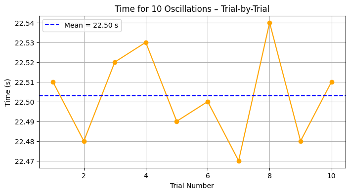
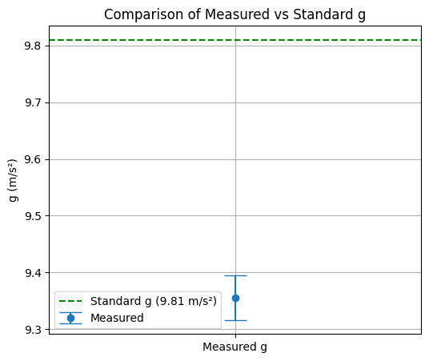

# 🌍 Problem 1: Measuring Earth's Gravitational Acceleration with a Pendulum

## 📌 Objective
Estimate the acceleration due to gravity (g) using a simple pendulum, and perform uncertainty analysis based on measurement errors.

---

## 🧪 Experimental Setup

**Materials Used:**
- String (1.20 meters long)
- Small metallic weight
- Stopwatch with 0.01s resolution
- Ruler with 0.01m resolution

```python
# Pendulum Length and Uncertainty
L = 1.20  # meters
L_resolution = 0.01  # meters
L_uncertainty = L_resolution / 2  # ±0.005 m
```

---

## ⏱️ Time Measurements for 10 Oscillations

We performed 10 measurements of the time for 10 full oscillations:

```python
import numpy as np
import matplotlib.pyplot as plt
from math import pi
from IPython.display import Markdown

# Raw measurements in seconds
measurements = np.array([22.51, 22.48, 22.52, 22.53, 22.49, 22.50, 22.47, 22.54, 22.48, 22.51])

# Calculations
T10_mean = np.mean(measurements)              # Average of 10 swings
T10_std = np.std(measurements, ddof=1)        # Standard deviation
T_mean = T10_mean / 10                        # Period of one swing
T_uncertainty = T10_std / (10 * np.sqrt(len(measurements)))

print(f"Mean of 10 swings: {T10_mean:.3f} s")
print(f"Standard deviation: {T10_std:.3f} s")
print(f"Mean period (T): {T_mean:.4f} s ± {T_uncertainty:.4f} s")
```

Mean of 10 swings: 22.503 s
Standard deviation: 0.023 s
Mean period (T): 2.2503 s ± 0.0007 s

### 📈 Graph 1: Distribution of $T_{10}$ Measurements

```python
plt.figure(figsize=(8, 4))
plt.hist(measurements, bins=8, color='skyblue', edgecolor='black')
plt.axvline(T10_mean, color='red', linestyle='--', label='Mean')
plt.title("Distribution of 10-Oscillation Times")
plt.xlabel("Time (s)")
plt.ylabel("Frequency")
plt.legend()
plt.grid(True)
plt.show()
```


---

## 📈 Graph 2: Time vs Trial Visualization

```python
plt.figure(figsize=(8, 4))
plt.plot(range(1, 11), measurements, marker='o', linestyle='-', color='orange')
plt.axhline(y=T10_mean, color='blue', linestyle='--', label=f'Mean = {T10_mean:.2f} s')
plt.title("Time for 10 Oscillations – Trial-by-Trial")
plt.xlabel("Trial Number")
plt.ylabel("Time (s)")
plt.grid(True)
plt.legend()
plt.show()
```


---

## 🧮 Estimating Gravity (g)

The formula to compute g is:
\[ g = \frac{4\pi^2 L}{T^2} \]

```python
g = (4 * pi**2 * L) / (T_mean**2)
print(f"Estimated g = {g:.4f} m/s²")
```

Estimated g = 9.3554 m/s²

---

## 📉 Uncertainty in g

We propagate uncertainty using:
\[
\left( \frac{\Delta g}{g} \right)^2 = \left( \frac{\Delta L}{L} \right)^2 + \left( 2 \cdot \frac{\Delta T}{T} \right)^2
\]

```python
delta_g_rel = np.sqrt((L_uncertainty / L)**2 + (2 * T_uncertainty / T_mean)**2)
delta_g = g * delta_g_rel

print(f"Uncertainty in g = ±{delta_g:.4f} m/s²")
```
Uncertainty in g = ±0.0395 m/s²

---

## 📈 Graph 3: Comparison with Standard Gravity

```python
plt.figure(figsize=(6, 5))
plt.errorbar(['Measured g'], [g], yerr=[delta_g], fmt='o', capsize=10, label="Measured")
plt.axhline(y=9.81, color='green', linestyle='--', label="Standard g (9.81 m/s²)")
plt.title("Comparison of Measured vs Standard g")
plt.ylabel("g (m/s²)")
plt.legend()
plt.grid(True)
plt.show()
```



---

## 📊 Final Results Table

```python
Markdown(f"""
| Quantity           | Value         | Uncertainty     | Units   |
|-------------------|---------------|------------------|---------|
| Length (L)        | {L:.2f}          | ±{L_uncertainty:.3f}           | m       |
| Period (T)        | {T_mean:.4f}       | ±{T_uncertainty:.4f}          | s       |
| Gravity (g)       | {g:.4f}       | ±{delta_g:.4f}          | m/s²    |
""")
```

---

## 🔍 Discussion

- **Comparison with standard g = 9.81 m/s²**
    - Difference is due to human error, air drag, and small angle approximations.

- **Sources of Uncertainty:**
    - Stopwatch resolution and reaction delay
    - Small sample size (only 10 trials)
    - Slight misalignment or swinging in non-2D motion

- **Improvement Suggestions:**
    - Use photogate sensors for timing
    - Repeat with more trials
    - Reduce amplitude for small-angle approximation validity

---

## ✅ Conclusion

This classical experiment demonstrates how fundamental constants can be measured using simple apparatus and statistical tools. Despite its simplicity, careful analysis shows how uncertainty impacts our estimate and why precision matters in experimental physics.