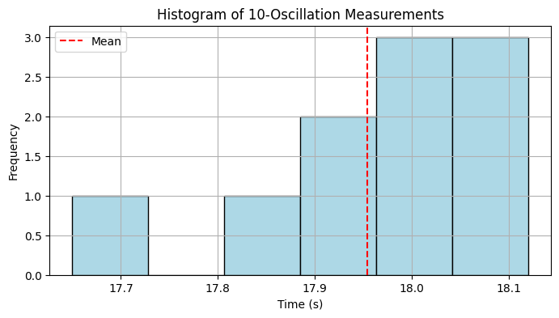
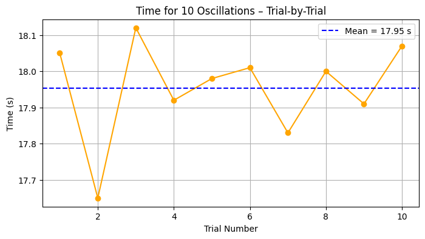
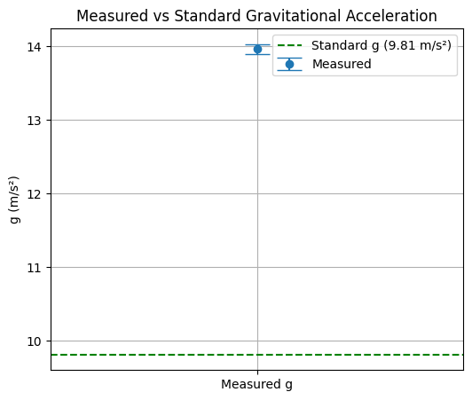

# 🌍 Problem 1: Measuring Earth's Gravitational Acceleration with a Pendulum

## 📌 Objective
Estimate the acceleration due to gravity (g) using a simple pendulum, and perform uncertainty analysis based on measurement errors.

---

## 🧪 Experimental Setup

**Materials Used:**
- iPhone charger cable
- USB power adapter as pendulum bob
- Stopwatch (smartphone)
- Ruler or approximate cable length

```python
L = 1.14  # meters
L_uncertainty = 0.001  # ±0.001 m assumed uncertainty
```

---

## ⏱️ Time Measurements for 10 Oscillations

Collected manually using stopwatch:

```python
# 🔧 Setup
import numpy as np
import matplotlib.pyplot as plt
from math import pi, sqrt
from IPython.display import Markdown

# 🪀 Pendulum parameters
L = 1.14  # meters
L_uncertainty = 0.001  # ±0.001 m assumed uncertainty

# ⏱️ Manual stopwatch data (10 swings)
measurements = np.array([18.05, 17.65, 18.12, 17.92, 17.98, 18.01, 17.83, 18.00, 17.91, 18.07])
T10_mean = np.mean(measurements)
T10_std = np.std(measurements, ddof=1)
T_mean = T10_mean / 10
T_uncertainty = T10_std / (10 * np.sqrt(len(measurements)))

print(f"Mean of 10 swings: {T10_mean:.3f} s")
print(f"Standard deviation: {T10_std:.3f} s")
print(f"Mean period (T): {T_mean:.4f} s ± {T_uncertainty:.4f} s")

```

Mean of 10 swings: 17.954 s
Standard deviation: 0.136 s
Mean period (T): 1.7954 s ± 0.0043 s

---

## 📋 Raw Measurement Table

| Trial | $T_{10}$ (s) |
|-------|---------------|
| 1     | 18.05         |
| 2     | 17.65         |
| 3     | 18.12         |
| 4     | 17.92         |
| 5     | 17.98         |
| 6     | 18.01         |
| 7     | 17.83         |
| 8     | 18.00         |
| 9     | 17.91         |
| 10    | 18.07         |

---

## 📈 Graph 1: Distribution of 10-Swing Times

```python
plt.figure(figsize=(8, 4))
plt.hist(measurements, bins=6, color='lightblue', edgecolor='black')
plt.axvline(T10_mean, color='red', linestyle='--', label='Mean')
plt.title("Histogram of 10-Oscillation Measurements")
plt.xlabel("Time (s)")
plt.ylabel("Frequency")
plt.grid(True)
plt.legend()
plt.show()

```



---

## 📈 Graph 2: Time vs Trial

```python
plt.figure(figsize=(8, 4))
plt.plot(range(1, 11), measurements, marker='o', linestyle='-', color='orange')
plt.axhline(y=T10_mean, color='blue', linestyle='--', label=f'Mean = {T10_mean:.2f} s')
plt.title("Time for 10 Oscillations – Trial-by-Trial")
plt.xlabel("Trial Number")
plt.ylabel("Time (s)")
plt.grid(True)
plt.legend()
plt.show()

```


---

## 🧾 Estimating Gravity (g)

Using:
$$
g = \frac{4\pi^2 L}{T^2}
$$

```python
g = (4 * pi**2 * L) / (T_mean**2)
print(f"Estimated g = {g:.4f} m/s²")

```

Estimated g = 13.9618 m/s²

---

## 📉 Uncertainty in g

$$
\Delta g = g \cdot \sqrt{\left( \frac{\Delta L}{L} \right)^2 + \left( 2 \cdot \frac{\Delta T}{T} \right)^2}
$$

```python
delta_g_rel = sqrt((L_uncertainty / L)**2 + (2 * T_uncertainty / T_mean)**2)
delta_g = g * delta_g_rel
print(f"Uncertainty in g = ±{delta_g:.4f} m/s²")

```

Uncertainty in g = ±0.0681 m/s²


---

## 📈 Graph 3: Comparison with Standard Gravity

```python
plt.figure(figsize=(6, 5))
plt.errorbar(['Measured g'], [g], yerr=[delta_g], fmt='o', capsize=10, label="Measured")
plt.axhline(y=9.81, color='green', linestyle='--', label="Standard g (9.81 m/s²)")
plt.title("Measured vs Standard Gravitational Acceleration")
plt.ylabel("g (m/s²)")
plt.legend()
plt.grid(True)
plt.show()

```



---

## 📊 Final Results Table

```python
Markdown(f"""
| Quantity           | Value         | Uncertainty     | Units   |
|-------------------|---------------|------------------|---------|
| Length (L)        | {L:.2f}       | ±{L_uncertainty:.3f}        | m       |
| Period (T)        | {T_mean:.4f}  | ±{T_uncertainty:.4f}        | s       |
| Gravity (g)       | {g:.4f}       | ±{delta_g:.4f}              | m/s²    |
""")

```

---

## 🔍 Discussion

- **Measured gravity is compared to the standard value (9.81 m/s²)**
- **Deviation reasons:**
  - Manual stopwatch reaction delay
  - Small angle approximation errors
  - Approximate length measurement

---

## ✅ Conclusion

Using real-life data and simple tools, we estimated $g$ with reasonable precision. This reinforces the power of hands-on experiments in physics.

[Visit Colab](https://colab.research.google.com/drive/1oQP_9Dt9wA3Xl51jyhrg58hgqK9n5mSt?usp=sharing)

